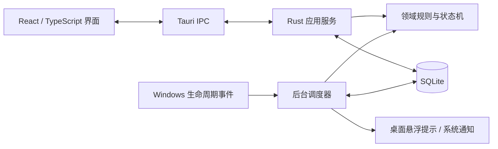

# 摸个鱼 · TakeFive

> 一款安静、可靠、本地优先的桌面提醒应用，按你的规则提醒喝水、休息、下班和不想忘记的小事。


TakeFive 面向长时间使用电脑的人。它不要求你一直记着“下一次什么时候该休息”，也不会用抢焦点的大弹窗打断工作。提醒规则、发生记录和运行状态由本机 Rust 核心与 SQLite 管理，主窗口关闭后仍可在后台继续工作。

> [!IMPORTANT]
> 当前版本是 `0.1.0` MVP 预览版，主功能已实现并通过自动化测试，但 Windows 安装包、签名和完整真机验收尚未完成。暂不建议用于不能错过的医疗、用药或安全关键提醒。macOS 仍处于后续适配计划中。

<p align="center">
  
</p>
<p align="center"><sub>轻量桌面提示：不抢焦点，8 秒后自动收起，也可通过点击或继续键入立即收起。</sub></p>

## 为什么做 TakeFive

- **安静而不失联**：右下角轻量提示是默认投递方式；创建失败时再降级到系统通知。
- **本地优先**：无需账号或云端服务，提醒和事件数据保存在本机 SQLite 数据库。
- **可靠调度**：权威计时在 Rust 后台完成，不依赖前端 `setTimeout` 或主窗口持续打开。
- **休眠后不轰炸**：启动、唤醒、解锁、系统时间或时区变化后重新对账，循环提醒不会成批补发。
- **同一事件最多展示一次**：稳定事件标识、SQLite 唯一约束与原子认领共同防止重复投递。
- **时间规则可测试**：使用可注入时钟，并覆盖 IANA 时区、夏令时跳时与回拨等边界。

## 当前能力

| 领域 | 已实现能力 |
| --- | --- |
| 提醒规则 | 固定时间、按锚点对齐的间隔循环、一次性提醒；支持工作日/每天、生效时段和午休排除 |
| 提醒管理 | 创建、查看规则摘要和下次触发时间、启用、停用、软删除 |
| 桌面投递 | 主屏工作区右下角透明悬浮提示、8 秒自动收起、点击/新按键收起、多提醒顺序排队、系统通知兜底 |
| 后台运行 | 系统托盘、单实例、关闭主窗口后继续调度、Windows 开机自动启动 |
| 暂停 | 全部提醒暂停 30 分钟、1 小时或 2 小时，并可立即恢复 |
| 系统恢复 | 启动、休眠/唤醒、锁屏/解锁、系统时间变化和时区变化后重新核对 |
| 数据可靠性 | SQLite migration、revision 冲突保护、Occurrence 状态机、原子认领与恢复 |
| 设置与诊断 | 通知权限状态与测试通知、本地数据库健康状态、提醒数量与数据位置 |

## 运行原理



SQLite 是事件状态的唯一事实来源。后台调度器从数据库重建候选事件，在投递前执行暂停、休眠、全屏等策略判断，并在数据库中原子认领对应 Occurrence。前端只展示结果和提交用户意图，不承担权威计时或直接访问数据库。

## 快速开始

### 环境要求

- Windows 10/11（当前主要开发与验证平台）
- [Rust stable](https://www.rust-lang.org/tools/install)
- Node.js `20.19+` 或 `22.12+`
- [Tauri 2 系统依赖](https://v2.tauri.app/start/prerequisites/)（Windows 需要 WebView2 与 Microsoft C++ Build Tools）

### 开发运行

在克隆后的仓库中执行：

```powershell
cd apps/desktop
npm ci
npm run tauri dev
```

应用关闭主窗口后仍会留在系统托盘。需要彻底结束进程时，请从托盘菜单选择“退出应用”。

### 本地构建

```powershell
cd apps/desktop
npm ci
npm run tauri build -- --no-bundle --ci
```

该命令只生成本机 Release 程序，不生成安装包。项目目前还没有可供普通用户下载的正式 Release。

## 质量校验

```powershell
# 仓库根目录
cargo fmt --all -- --check
cargo clippy --workspace --all-targets -- -D warnings
cargo test --workspace

# 前端
cd apps/desktop
npm ci
npm run build
```

当前测试重点覆盖调度去重、并发认领、进程重启恢复、暂停策略、固定锚点、DST、休眠恢复，以及悬浮提示的队列和收起行为。GitHub Actions 会在 Windows 环境执行相同的格式、静态检查、测试与前端构建门禁。

## 项目结构

```text
TakeFive/
├─ apps/desktop/                 # React 界面与 Tauri 桌面进程
│  ├─ src/                       # 主窗口、提醒编辑器与桌面悬浮提示
│  └─ src-tauri/                 # IPC、托盘、窗口、通知和 Windows 适配
├─ crates/domain/                # 纯领域模型、时间规则与状态机
├─ crates/application/           # 用例编排与事务边界
├─ crates/persistence-sqlite/    # SQLite migration 与 Repository
├─ crates/scheduler/             # 候选计算、策略判断与恢复对账
└─ docs/                         # 产品、架构、里程碑与验收文档
```

## 当前阶段与路线图

| 状态 | 内容 |
| --- | --- |
| 已完成 | Windows MVP 的设置、提醒和桌面悬浮提示主链路；本地持久化与可靠调度核心 |
| 验收中 | Windows 通知、托盘、开机启动、休眠/唤醒、锁屏/解锁和多显示器真机场景 |
| 发布前 | 品牌应用图标、Windows 安装包、代码签名、版本发布流程和用户安装说明 |
| 后续计划 | 完成/延后/跳过交互、安静时段、提醒历史与原因说明、macOS 适配与公证 |

路线图描述的是方向而非承诺日期。具体范围以 [MVP 开发交付](docs/TakeFive-MVP开发交付-v1.0.md) 和后续 Issue/Milestone 为准。

## 隐私说明

- 不要求账号，不依赖业务后端，核心功能离线可用。
- 提醒配置和事件状态默认只保存在系统分配的本机应用数据目录。
- 不读取或保存键盘输入内容；提醒显示期间只观察是否出现新的按键状态，用于收起浮窗。
- 不采集屏幕内容、窗口标题、麦克风、摄像头或鼠标轨迹。
- 当前版本不包含遥测或用户行为上传。

## 设计与开发文档

- [MVP 开发交付与真机验收](docs/TakeFive-MVP开发交付-v1.0.md)
- [产品功能详细设计 V1.2](docs/TakeFive-产品功能详细设计-v1.2.md)
- [技术架构设计 V1.0](docs/TakeFive-技术架构设计-v1.0.md)
- [开发任务拆分与里程碑 V1.0](docs/TakeFive-开发任务拆分与里程碑-v1.0.md)
- [阶段 1 开发进展 V0.2](docs/TakeFive-阶段1开发进展-v0.2.md)
- [阶段 0 技术预研报告](docs/TakeFive-阶段0技术预研报告-v0.1.md)

## 参与贡献

欢迎提交问题、建议和改进。开始前请阅读 [贡献指南](CONTRIBUTING.md)；安全问题请按 [安全策略](SECURITY.md) 提交，避免在公开 Issue 中披露可利用细节。

## 许可证

本项目基于 [MIT License](LICENSE) 开源。
