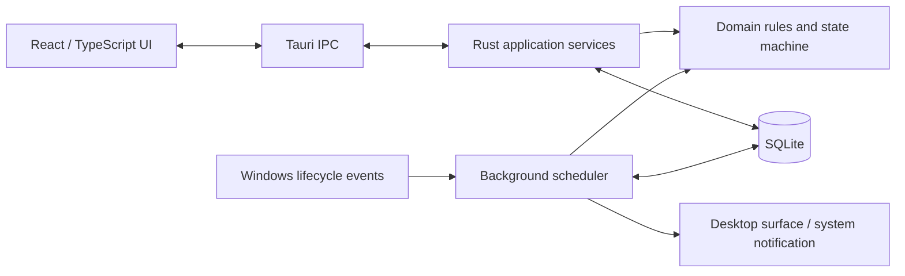

# TakeFive — Quiet reminders for healthier workdays

> A local-first desktop companion for people who spend long hours at a screen. It does not ask you to become more productive. It simply remembers the glass of water, the view beyond the screen, a little movement, a proper meal, and the time to call it a day.

<p align="center">
  <a href="README.md"><strong>English</strong></a> ·
  <a href="README.zh-CN.md">简体中文</a> ·
  <a href="README.ja.md">日本語</a> ·
  <a href="README.es.md">Español</a>
</p>

<p align="center">
  
  
  
  
  
</p>

<p align="center">
  
</p>
<p align="center"><sub>One small prompt, right when it helps. No focus stealing. Dismisses after 7 seconds by default, or lets you complete, snooze, skip, or dismiss.</sub></p>

> [!IMPORTANT]
> TakeFive is currently a `0.1.0` MVP preview. GitHub Releases and signed in-app updates are wired up, while Windows code signing, the first public release, and complete real-device acceptance are still in progress. It is not a replacement for medical, medication, or safety-critical reminders. macOS support is planned, not released.

## The idea

Most reminder apps make you manage the reminder instead of caring for your day. TakeFive is designed around a calmer promise: configure a rule once, see exactly what happens next, and carry on without a notification storm.

### A small note from the people making it

TakeFive began with a very ordinary concern. People who care about their work often sit down for far too long. The water goes cold, shoulders tighten, meals get pushed aside, and daylight disappears before anyone notices.

We are not building another scorecard for your life. There are no moral victories in a perfect streak, and no failure in snoozing or skipping a reminder. Looking after yourself should not become one more source of pressure. We only hope TakeFive can be a quiet, kind presence that remembers the small things when work takes all your attention.

Software cannot fix every kind of tiredness. But if it helps one person drink another glass of water, rest their eyes, or close the laptop a little earlier, it has done something worthwhile. We hope you do good work, live a full life, and stay safe and well.

### A healthier rhythm for everyone who cares about their work

| Use case | What TakeFive can do today | The direction we are exploring |
| --- | --- | --- |
| **Eye-break rhythm** | Create a 45- or 60-minute aligned reminder with copy that nudges you to look away and rest. | A ready-made 20-20-20 preset with optional semi-transparent or full-screen break surfaces. |
| **Stand, stretch, hydrate** | Schedule recurring prompts for water, movement, or a custom habit; pause them for a meeting or deep-focus block. | Built-in 30-second, 1-minute, and 3-minute movement cards. |
| **A time to wrap up** | Add a one-shot “wrap up” reminder for the end of a workday. | A bedtime countdown and a gentle “call it a night” mode. |
| **Caffeine check-in** | Keep all reminder data local and create a simple caffeine check-in rule. | A local caffeine log with a transparent estimate of possible sleep impact. |
| **Pomodoro with care** | Combine aligned intervals, quiet hours, and reminder copy that makes a short pause feel natural. | A dedicated focus mode that suggests water, movement, or one minute away from the screen. |
| **Lightweight self-checks** | Deliver low-friction distance, breathing, or “look away for 20 seconds” prompts as ordinary reminders. | Optional eye-fatigue check cards, clearly positioned as self-management rather than medical advice. |
| **A kinder weekly look-back** | Persist reminder events and explain scheduler outcomes in local storage. | A weekly view of focus time, late nights, skipped breaks, and hydration habits, without a discipline score. |
| **Quiet desktop companion** | Run from the tray, stay offline, and keep working after the main window closes. | Offline breathing exercises, white noise, and small end-of-day reflection cards. |

The table is intentionally honest: the left column describes the current product foundation; the right column is a product direction, not a promise that those features already ship.

## Why it feels different

- **Caring, never demanding.** A bottom-right floating surface does not steal focus. It auto-dismisses after 7 seconds by default and supports complete, snooze, skip, and dismiss actions, without making a missed break feel like failure.
- **Reliable in the background.** The Rust scheduler owns authoritative timing; the app does not depend on a browser tab or a front-end `setTimeout`.
- **Recovery-aware.** After startup, sleep/wake, lock/unlock, system-time, or timezone changes, TakeFive reconciles from SQLite instead of replaying a backlog of stale notifications.
- **Private by design.** No account, cloud service, telemetry, keyboard contents, window titles, screen capture, microphone, camera, or mouse tracking.
- **Easy to understand.** Every enabled rule exposes a next-trigger time. Pauses, quiet hours, and suppressed events have a concrete reason instead of a mysterious “missed” state.
- **A real desktop citizen.** Tray support, single-instance behavior, optional Windows auto-start, configurable quiet hours, and a fallback to system notifications when needed.

## Current capabilities

| Area | Included in the MVP |
| --- | --- |
| Reminder rules | Fixed times, anchor-aligned intervals, one-shot reminders, workdays/every day, active windows, and lunch exclusions |
| Reminder management | Create, view summaries and next trigger, enable, disable, and soft-delete reminders |
| Delivery | Transparent bottom-right desktop surface, configurable auto-dismiss (7 seconds by default), complete/snooze/skip/dismiss, queued reminders, and system-notification fallback |
| Background runtime | System tray, single instance, continued scheduling after the main window closes, and Windows auto-start (enabled by default, configurable) |
| Pause and quiet hours | Pause all reminders for 30 minutes, 1 hour, or 2 hours; daily quiet hours defaulting to 12:00–13:30, including overnight ranges |
| First run and languages | A guided first launch with localized starter templates, or a clean start; UI available in English, Simplified Chinese, Japanese, and Spanish |
| Recovery and data | Startup, sleep/wake, lock/unlock, system-time, and timezone reconciliation; SQLite migrations, revision protection, occurrence state machine, atomic claiming, and recovery |
| Settings and diagnostics | Notification permission state and test notification, local database health, reminder counts, and data location |

## How it works



SQLite is the source of truth for event state. The scheduler rebuilds candidates from the database, applies pause/sleep/full-screen policies, and atomically claims an occurrence before delivery. The front end presents results and submits user intent; it does not own authoritative timing or access the database directly.

## Quick start

### Requirements

- Windows 10/11 (the primary development and validation platform)
- [Rust stable](https://www.rust-lang.org/tools/install)
- Node.js `20.19+` or `22.12+`
- [Tauri 2 prerequisites](https://v2.tauri.app/start/prerequisites/) — WebView2 and Microsoft C++ Build Tools on Windows

### Run locally

```powershell
cd apps/desktop
npm ci
npm run tauri dev
```

Closing the main window keeps TakeFive in the system tray. Use the tray menu to quit the process completely.

### Build locally

```powershell
cd apps/desktop
npm ci
npm run tauri build -- --no-bundle --ci
```

This creates a local Release executable, not an installer. Version tags trigger the GitHub Actions installer build; the resulting draft is published to GitHub Releases after device validation.

## Platforms and downloads

| Platform | Target | Validation status | Distribution |
| --- | --- | --- | --- |
| Windows | Windows 10/11 x64 | Windows 11 x64 validated; Windows 10 final device regression pending | NSIS installer and signed in-app updates through GitHub Releases; Windows code signing is still pending |
| Windows 7/8/8.1 | Legacy evaluation only | Not validated with the current Rust/WebView2 toolchain | Do not assume the current executable supports these versions |
| macOS | macOS 10.13+ target, Apple Silicon first | Cannot be signed, notarized, or device-tested from the current Windows host | Developer ID DMG planned; no macOS package yet |

## Quality checks

```powershell
# From the repository root
cargo fmt --all -- --check
cargo clippy --workspace --all-targets -- -D warnings
cargo test --workspace

# Front end
cd apps/desktop
npm ci
npm run build
```

The test suite focuses on duplicate prevention, concurrent claiming, restart recovery, pause policy, anchored intervals, DST, sleep recovery, and the reminder-surface queue/dismiss behavior. GitHub Actions runs the same formatting, lint, test, and front-end build gates on Windows.

## Project structure

```text
TakeFive/
├─ apps/desktop/                 # React UI and Tauri desktop process
│  ├─ src/                       # Main window, reminder editor, desktop surface
│  └─ src-tauri/                 # IPC, tray, windows, notifications, Windows adapter
├─ crates/domain/                # Pure Rust domain rules, time, and state machine
├─ crates/application/           # Use-case orchestration and transaction boundaries
├─ crates/persistence-sqlite/    # SQLite migrations and repositories
├─ crates/scheduler/             # Candidate calculation, policy, and recovery
└─ docs/                         # Current architecture and MVP acceptance docs
```

## Roadmap

- **Now:** harden the Windows MVP, finish notification/tray and sleep/wake device validation, and prepare a signed installer.
- **Next:** reminder history and explainable outcomes, localized delivery copy, richer break surfaces, macOS support and notarization.
- **Later:** built-in action cards, bedtime and caffeine helpers, lightweight weekly reviews, and optional offline calm-down content.

Roadmap items describe direction, not dates. See the [MVP delivery plan](docs/TakeFive-MVP开发交付-v1.0.md) and the repository issues/milestones for current scope.

## Privacy

- No account or business backend is required; core behavior works offline.
- Reminder configuration and event state stay in the local application data directory by default.
- TakeFive does not read or store keyboard input, screen contents, window titles, microphone, camera, or mouse trails.
- The current version contains no telemetry or behavioral uploads.

## Documentation

- [MVP delivery and device acceptance](docs/TakeFive-MVP开发交付-v1.0.md)
- [Current technical architecture](docs/TakeFive-技术架构设计-v1.0.md)
- [Release and automatic-update runbook](docs/releasing.md)

## Contributing

Issues, product feedback, and pull requests are welcome. Start with [CONTRIBUTING.md](CONTRIBUTING.md); report security issues through [SECURITY.md](SECURITY.md) rather than a public issue.

## License

Released under the [MIT License](LICENSE).
