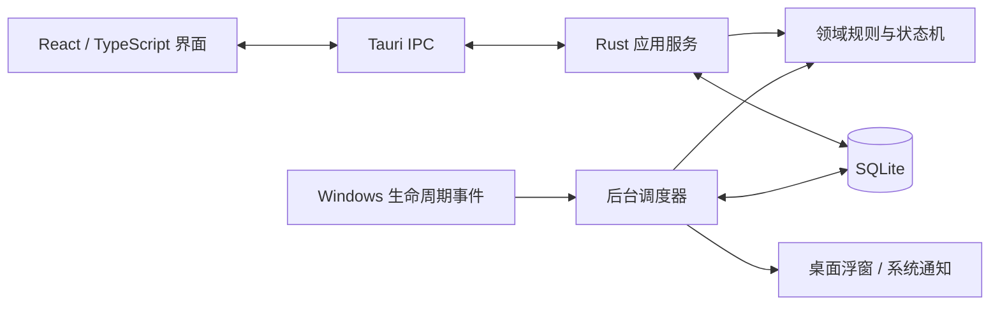

# 摸个鱼 · TakeFive —— 给长时间用电脑的人，一点安静的照顾

> 一款本地优先的桌面提醒伴侣。为喝水、护眼、起身、专注和下班收尾设定节奏，然后让 TakeFive 在后台安静地替你记住时间。

<p align="center">
  <a href="README.md">English</a> ·
  <a href="README.zh-CN.md"><strong>简体中文</strong></a> ·
  <a href="README.ja.md">日本語</a> ·
  <a href="README.es.md">Español</a>
</p>

<p align="center">
  
  
  
  
  
</p>

<p align="center">
  
</p>
<p align="center"><sub>一条刚刚好的提示，出现在真正需要的时候。不抢焦点，默认 7 秒后收起，也可以直接完成、延后、跳过或收起。</sub></p>

> [!IMPORTANT]
> 当前版本是 `0.1.0` MVP 预览版。GitHub Releases 与签名自动更新流程已经接入，但 Windows 代码签名、首次正式 Release 和完整真机验收仍在进行中。它不替代医疗、用药或安全关键提醒；macOS 支持仍在规划中。

## 这是什么

很多提醒工具让你一直管理提醒，而不是管理生活。TakeFive 想做得更轻：设定一次规则，清楚看到下一次什么时候发生，然后继续工作，不被通知风暴拖走。

### 为程序员真正会用的健康节奏而做

| 场景 | 今天就能做到 | 正在探索的方向 |
| --- | --- | --- |
| **程序员护眼打断器** | 创建每 45/60 分钟一次的对齐提醒，用文案提示你看远处、放松眼睛。 | 一键启用 20-20-20 规则，以及可选半透明/全屏休息界面。 |
| **久坐拉伸与喝水** | 为喝水、起身、肩颈活动或自定义习惯设置循环提醒，会议或专注时可暂停。 | 内置 30 秒、1 分钟、3 分钟动作卡片。 |
| **程序员睡眠倒计时** | 设置一次性的“准备收尾”提醒，给工作日画下边界。 | 睡前倒计时与“今晚别熬夜”模式。 |
| **咖啡因管理器** | 提醒数据完全保存在本机，可先用简单规则记录咖啡因检查点。 | 本地咖啡/茶/能量饮料记录与睡眠影响估算。 |
| **番茄钟 + 养生模式** | 组合对齐间隔、安静时段和手动开始的休息会话。 | 在专注结束后建议喝水、起身或闭眼一分钟。 |
| **眼疲劳自测小窗** | 用普通提醒发送“看远处 20 秒”或呼吸提示，轻量、不打扰。 | 可选眼疲劳自我管理卡片，不做医疗诊断。 |
| **程序员作息复盘器** | 本地保存提醒事件和调度结果，便于理解发生了什么。 | 每周回顾专注时长、熬夜、跳过休息和喝水习惯。 |
| **情绪降噪桌面伴侣** | 常驻托盘、离线运行，主窗口关闭后仍继续工作。 | 离线呼吸练习、白噪音和下班前的短提示卡。 |

左栏是当前产品基础，右栏是产品方向，不代表这些功能已经全部发布。

## 为什么值得常驻

- **安静但不失联。** 桌面右下角轻量浮窗不抢焦点，默认 7 秒后收起，并支持完成、延后、跳过和收起。
- **后台真的在工作。** 权威计时由 Rust 调度器负责，不依赖浏览器页面或前端 `setTimeout`。
- **能处理现实世界的变化。** 启动、休眠/唤醒、锁屏/解锁、系统时间或时区变化后，从 SQLite 重新对账，不把过期提醒一次性轰炸出来。
- **隐私优先。** 不需要账号或云服务，不读取键盘内容、窗口标题、屏幕、麦克风、摄像头或鼠标轨迹。
- **规则讲得明白。** 每条启用规则都显示下一次时间；暂停、安静时段和未展示事件都有具体原因。
- **像一个真正的桌面应用。** 支持系统托盘、单实例、可选开机启动、安静时段，以及系统通知不可用时的降级投递。

## 当前能力

| 领域 | MVP 已包含 |
| --- | --- |
| 提醒规则 | 固定时间、按锚点对齐的间隔循环、一次性提醒、工作日/每天、生效时段和午休排除 |
| 提醒管理 | 创建、查看摘要和下次触发时间、启用、停用和软删除 |
| 桌面投递 | 右下角透明浮窗、默认 7 秒自动收起且可配置、完成/延后/跳过/收起、多提醒排队、系统通知兜底 |
| 后台运行 | 系统托盘、单实例、关闭主窗口后继续调度、Windows 开机自动启动（默认开启，可关闭） |
| 暂停与安静时段 | 暂停全部提醒 30 分钟、1 小时或 2 小时；默认每天 12:00–13:30 安静，支持跨午夜 |
| 首次启动与语言 | 按当前语言和时区启用推荐模板，也可跳过引导；界面支持中文、英文、日文、西班牙文 |
| 恢复与数据 | 启动、休眠/唤醒、锁屏/解锁、时间和时区变化后重新核对；SQLite migration、revision 保护、Occurrence 状态机、原子认领与恢复 |
| 设置与诊断 | 通知权限状态和测试通知、本地数据库健康状态、提醒数量与数据位置 |

## 运行原理



SQLite 是事件状态的唯一事实来源。调度器从数据库重建候选事件，判断暂停、休眠、全屏等策略，并在投递前原子认领 Occurrence。前端只展示结果、提交用户意图，不承担权威计时，也不直接访问数据库。

## 快速开始

### 环境要求

- Windows 10/11（当前主要开发与验证平台）
- [Rust stable](https://www.rust-lang.org/tools/install)
- Node.js `20.19+` 或 `22.12+`
- [Tauri 2 系统依赖](https://v2.tauri.app/start/prerequisites/)：Windows 需要 WebView2 与 Microsoft C++ Build Tools

### 本地运行

```powershell
cd apps/desktop
npm ci
npm run tauri dev
```

关闭主窗口后应用仍会留在系统托盘。需要彻底结束进程时，请从托盘菜单退出。

### 本地构建

```powershell
cd apps/desktop
npm ci
npm run tauri build -- --no-bundle --ci
```

该命令只生成本机 Release 程序，不生成安装包。正式安装包由版本标签触发 GitHub Actions 构建，并在真机验收后发布到 GitHub Releases。

## 平台与下载

| 平台 | 目标 | 当前状态 | 分发方式 |
| --- | --- | --- | --- |
| Windows | Windows 10/11 x64 | Windows 11 x64 已验证，Windows 10 仍需最终真机回归 | GitHub Releases 提供 NSIS 安装包和签名自动更新；Windows 代码签名仍待配置 |
| Windows 7/8/8.1 | 仅评估 legacy 兼容性 | 当前 Rust/WebView2 工具链尚未验证 | 不要默认当前 EXE 支持这些版本 |
| macOS | macOS 10.13+，优先 Apple Silicon | 当前 Windows 主机无法完成签名、公证和真机验证 | 后续提供 Developer ID DMG；目前没有 macOS 包 |

## 质量校验

```powershell
# 仓库根目录
cargo fmt --all -- --check
cargo clippy --workspace --all-targets -- -D warnings
cargo test --workspace

# 前端
cd apps/desktop
npm ci
npm run build
```

测试重点覆盖调度去重、并发认领、进程重启恢复、暂停策略、固定锚点、DST、休眠恢复，以及浮窗队列和收起行为。GitHub Actions 会在 Windows 环境执行相同的格式、静态检查、测试与前端构建门禁。

## 路线图

- **现在：** 打磨 Windows MVP，完成通知/托盘与休眠唤醒真机验收，准备签名安装包。
- **下一步：** 提醒历史与原因说明、投递文案全链路本地化、更丰富的休息界面、macOS 适配与公证。
- **之后：** 动作卡片、睡眠与咖啡因辅助、轻量周报，以及可选的离线减压内容。

路线图是方向，不是日期承诺。范围以 [MVP 开发交付](docs/TakeFive-MVP开发交付-v1.0.md) 和仓库 Issue/Milestone 为准。

## 隐私

- 不需要账号或业务后端，核心功能可离线运行。
- 提醒配置和事件状态默认只保存在本机应用数据目录。
- 不读取或保存键盘输入、屏幕内容、窗口标题、麦克风、摄像头或鼠标轨迹。
- 当前版本不包含遥测或用户行为上传。

## 文档

- [MVP 开发交付与真机验收](docs/TakeFive-MVP开发交付-v1.0.md)
- [当前技术架构](docs/TakeFive-技术架构设计-v1.0.md)
- [发布与自动更新](docs/releasing.md)

## 参与贡献

欢迎提交 Issue、产品建议和 Pull Request。开始前请阅读 [CONTRIBUTING.md](CONTRIBUTING.md)；安全问题请按 [SECURITY.md](SECURITY.md) 提交，不要在公开 Issue 中披露可利用细节。

## 许可证

本项目基于 [MIT License](LICENSE) 开源。
