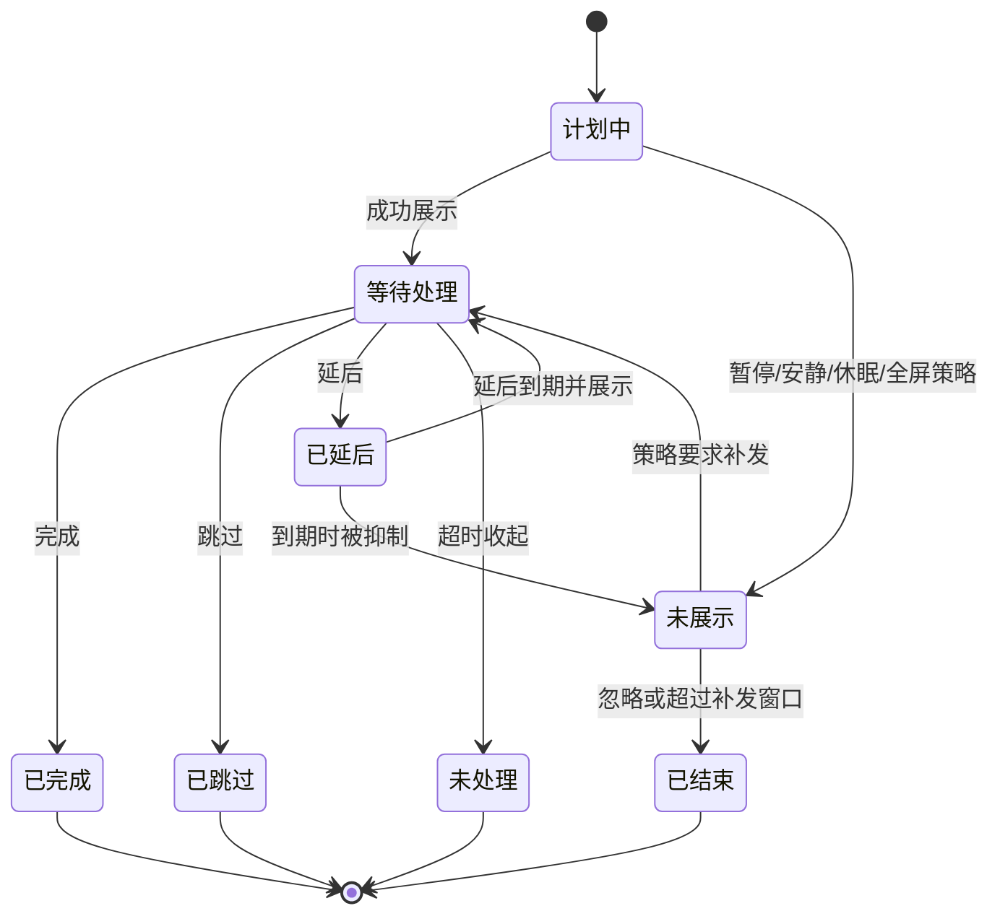

# 摸个鱼 · TakeFive 产品功能详细设计

**文档版本：** V1.2  
**文档日期：** 2026-07-14  
**上游需求：** 《摸个鱼 · TakeFive 需求设计文档 V1.1》  
**适用对象：** 产品、交互、视觉、客户端、测试  
**文档状态：** 产品基线，可用于原型、技术评审、任务拆分和验收  

---

## 0. 文档目的与版本结论

V1.1 已完整定义产品愿景和功能范围；V1.2 进一步回答设计、开发和测试最容易产生分歧的问题：

1. 用户具体如何创建、查看、暂停和处理提醒。
2. 每类规则在启动、延后、休眠、锁屏、勿扰和时间变化后如何计算。
3. 页面在正常、空白、加载、异常和降级状态下显示什么。
4. 同时发生多个条件时，以什么顺序得到唯一结果。
5. 首个可发布版本必须做什么，哪些能力应延后，避免核心体验被非核心功能稀释。

本版形成以下产品结论：

- **核心闭环只有一条：** 创建规则 -> 明确看到下一次提醒 -> 到点友好提醒 -> 完成/延后/跳过 -> 正确进入下一轮。
- **首发优先 Windows：** 代码架构继续保留 macOS 适配边界，Windows 稳定版通过真实场景验证后再发布 macOS 版。双平台同时首发会显著扩大休眠、权限、托盘、全屏和多显示器的验证面。
- **模板先于表单：** 新用户先用模板在 30 秒内启用提醒，再按需进入完整编辑器。
- **默认不打断：** 默认使用轻提醒，不抢焦点，不强制全屏，不默认播放高音量提示音。
- **高级能力渐进展示：** 创建页默认只展示名称、时间规则、生效日、提醒方式四组核心字段；排除日期、未处理重试、跨午夜等放入高级设置。
- **所有抑制都可解释：** 用户至少能看到“下一次何时提醒”和“本次为什么没有弹出”。
- **延后只影响本次：** 永不改变固定时间或对齐间隔的原始锚点。
- **不以完成率施压：** 记录用于回顾，不做排名、惩罚、红色失败提示或连续打卡压力。

---

## 1. 需求深度分析

### 1.1 用户真正购买的是“放心忘记”

用户不是缺少计时工具，而是在专注使用电脑时不愿持续记住“什么时候该喝水、休息或收尾”。产品价值不是弹窗数量，而是让用户相信：

- 规则配置一次即可长期生效。
- 不需要一直打开主窗口。
- 电脑休眠、锁屏或应用重启后不会失效或重复轰炸。
- 忙的时候可以快速延后，开会时可以一键安静。
- 用户随时知道应用是否仍在工作。

因此，可靠性、可预测性和低打扰优先于皮肤数量、复杂统计和趣味文案。

### 1.2 现有需求中的主要产品风险

| 风险 | 用户后果 | 本版处理 |
| --- | --- | --- |
| 规则能力过多且同时展示 | 首次创建成本高，不知道该选哪一种 | 模板优先，规则分型，高级设置折叠 |
| “暂停”和“勿扰”含义接近 | 用户不知道提醒是否会补发 | 手动行为统一称“暂停提醒”，自动时段称“安静时段”，状态原因再使用“勿扰” |
| 间隔起算点不明确 | 相同配置得到不同预期 | 增加首次提醒与锚点的明确口径 |
| 延后与下一周期冲突 | 连续弹两次或计划整体漂移 | 本次延后独立，接近下一计划时合并 |
| 休眠后批量补发 | 刚开电脑即被弹窗轰炸 | 健康循环默认忽略，一次性事项限时补发 |
| 系统通知权限不可控 | 用户以为应用坏了 | 权限状态常驻可见，自动降级到桌面浮窗 |
| 同时首发双平台 | 生命周期问题难以充分验证 | Windows 首发，macOS 紧随稳定版 |
| P0 包含大量外观和统计 | 研发投入偏离核心闭环 | 主题和复杂统计降级到后续版本 |

### 1.3 用户核心任务（JTBD）

| 用户任务 | 成功标准 | 失败信号 |
| --- | --- | --- |
| 快速启用常见提醒 | 30 秒内从模板启用并看到下一次时间 | 进入复杂表单后放弃 |
| 创建个性化规则 | 不阅读说明也能配置正确 | 保存后仍不知道何时触发 |
| 在忙碌时处理提醒 | 1 次点击完成、延后或跳过 | 浮窗抢焦点、按钮含义不清 |
| 临时停止打扰 | 2 次点击内暂停并显示恢复时间 | 忘记恢复或暂停后仍弹出 |
| 确认应用正常 | 打开托盘即可看到状态和下一条 | 用户必须打开设置排查 |
| 理解没有提醒的原因 | 时间线展示明确原因 | 用户认为应用漏提醒 |

### 1.4 体验原则及优先级

当原则冲突时，按以下优先级决策：

1. 不重复、不丢配置。
2. 不在明确不适合的场景打断用户。
3. 规则结果可理解、可追溯。
4. 常用操作更快。
5. 个性化与趣味性。

---

## 2. 产品范围与发布策略

### 2.1 首发 MVP

MVP 只验证“桌面提醒是否可靠且不打扰”，包含：

- Windows 10/11 桌面常驻、托盘、开机启动。
- 首次引导、通知权限检测、测试提醒。
- 今日、提醒、设置三个一级页面；记录作为今日页二级入口。
- 固定时间、对齐间隔、连续使用、一次性四类规则。
- 完成、延后、跳过、未处理。
- 单条暂停、全部暂停、安静时段、全屏抑制。
- 休眠、锁屏、关机、时间和时区变化后的正确恢复。
- 系统通知和应用浮窗两种投递方式。
- 本地记录、配置导出和自动快照。

### 2.2 首发不应阻塞的能力

以下能力有价值，但不应阻塞核心版本发布：

- macOS 正式发布。
- 6 套完整主题、用户背景图、自定义提示音。
- 复杂图表、连续天数和自定义统计范围。
- 自动会议识别、系统日历和法定节假日联网数据。
- 覆盖全部显示器的全屏休息。
- 自定义全局快捷键。

### 2.3 发布闸门

首发必须满足：

- 72 小时常驻运行无重复提醒和配置丢失。
- 休眠/唤醒、锁屏/解锁、异常退出恢复均通过实机验证。
- 创建任意一种规则后都能立即给出唯一的下一次提醒时间。
- 权限关闭时仍能通过应用浮窗完成核心提醒。
- 125% 和 150% 缩放、多显示器拔插下窗口保持可用。

---

## 3. 用户心智模型与统一术语

### 3.1 用户只需理解四个概念

| 概念 | 用户含义 | 界面表达 |
| --- | --- | --- |
| 提醒 | 一条长期或一次性的规则 | “喝水”“下班”“服药” |
| 下一次 | 当前条件下最近一次预计触发 | “今天 15:00，42 分钟后” |
| 暂停提醒 | 用户主动在一段时间内停止弹出 | “已暂停至 14:00” |
| 安静时段 | 每周自动生效的免打扰时间 | “午休 12:30-13:30” |

“计划事件、投递尝试、抑制、合并”等词只用于内部模型、诊断详情和测试，不出现在主流程中。

### 3.2 暂停与安静时段的明确差异

| 对比项 | 暂停提醒 | 安静时段 |
| --- | --- | --- |
| 触发方式 | 用户临时开启 | 按每周规则自动生效 |
| 典型场景 | 临时开会、深度专注 | 午休、固定会议、非工作时间 |
| 默认结束方式 | 到指定时间自动恢复 | 时间段结束自动退出 |
| 健康循环 | 本次忽略，不补发 | 本次忽略，不补发 |
| 一次性提醒 | 恢复后补发一次 | 时段结束后补发一次 |
| 重要提醒 | 用户明确授权后可绕过 | 用户明确授权后可绕过 |

当两者重叠时，界面只显示影响更直接的“已暂停”，详情中列出安静时段也在生效；恢复后若安静时段仍未结束，则状态变为“安静中”。

### 3.3 提醒结果的用户口径

- **完成：** 用户明确确认已处理，或完成休息倒计时。
- **延后：** 同一个本次提醒稍后再出现，不影响原始计划。
- **跳过：** 用户明确表示本次不处理，下一次照常。
- **未处理：** 提醒展示后超时收起，用户没有操作。
- **未展示：** 因暂停、安静、休眠或全屏没有弹出，必须带具体原因。

---

## 4. 全局交互框架

### 4.1 应用窗口

- 默认窗口建议尺寸为 1040 x 720，最小尺寸 860 x 600。
- Windows 使用左侧导航：今日、提醒、记录、设置；首发可将“记录”入口放入今日页，但信息架构预留独立页。
- 关闭主窗口默认最小化到托盘，首次关闭时用一次性提示说明应用仍在运行。
- 窗口重新打开时回到上次页面；若存在必须处理的配置异常，则回到对应页面并定位问题。
- 不在主窗口顶部长期展示营销文案、健康口号或功能说明。

### 4.2 全局状态条

主窗口顶部仅在异常或特殊状态时显示状态条：

| 状态 | 文案示例 | 主操作 | 次操作 |
| --- | --- | --- | --- |
| 全部暂停 | 提醒已暂停至 14:00 | 立即恢复 | 修改时间 |
| 安静中 | 午休安静时段，13:30 结束 | 暂时退出 | 查看规则 |
| 通知关闭 | 系统通知已关闭，将使用桌面浮窗 | 去开启 | 不再提示 |
| 只读保护 | 本地数据暂时无法写入，新操作不会保存 | 查看详情 | 重试 |
| 配置恢复 | 已从最近一次快照恢复设置 | 查看详情 | 知道了 |

正常运行时不显示绿色“系统正常”大横幅，避免占用长期空间；状态体现在今日页和托盘中。

### 4.3 通用反馈

- 保存成功：就地更新下一次时间，并显示 3 秒轻提示。
- 保存失败：保留用户输入，在字段或页面顶部说明原因，不关闭编辑器。
- 删除：确认后立即移出列表，提供 10 秒撤销。
- 开关：即时生效；若计算下一次时间超过 300 毫秒，显示行内加载状态。
- 网络不是核心依赖，核心页面不得出现联网加载骨架。
- 时间相关操作必须显示绝对时间，例如“暂停 1 小时，14:30 恢复”，不能只显示相对时长。

### 4.4 键盘与焦点

- `Ctrl/Cmd + N`：新建提醒，仅在应用窗口内生效。
- `Ctrl/Cmd + ,`：打开设置。
- `Esc`：关闭菜单、浮层或未保存编辑器；存在修改时先确认。
- 提醒浮窗不得自动夺取正在输入文本的焦点。
- 浮窗出现后可通过无障碍通知播报一次标题，不每秒播报倒计时。

---

## 5. 首次启动与首次成功体验

### 5.1 流程设计

首次引导采用 3 步，不单独要求用户理解全部功能：

1. **选一个想被提醒的事情。** 展示喝水、起身、护眼、下班四个推荐模板和“稍后设置”。
2. **允许桌面提醒。** 先说明用途，再调用系统权限；拒绝后允许继续。
3. **确认已开始。** 展示所选提醒和准确的下一次时间，提供“发送测试提醒”。

开机启动不单独占一页，在第 3 步以开关呈现，默认开启且可直接关闭。

### 5.2 模板卡片

卡片展示图标、名称、规则摘要和启用按钮，不展示长说明。例如：

- 喝水：工作日 09:00-18:00，每 60 分钟。
- 起身：连续使用电脑 50 分钟后。
- 护眼：连续使用电脑 45 分钟后，休息 20 秒。
- 下班：工作日 18:30。

用户点击“启用”即创建，点击卡片其他区域进入简化编辑。多选后一次性创建，不要求逐条保存。

### 5.3 权限分支

- 已允许：发送测试通知，成功后显示“提醒可以正常显示”。
- 已拒绝：显示“仍可使用桌面浮窗”，不阻断完成引导。
- 系统不支持或调用失败：直接启用桌面浮窗，并在设置中展示降级原因。
- 用户跳过模板：进入提醒空状态，主按钮为“创建第一个提醒”。

### 5.4 首次成功定义

用户完成以下任一行为即视为首次成功：

- 启用至少一个模板并看到下一次时间。
- 自定义创建一条提醒并保存成功。

测试通知不能替代真实提醒创建，不计为首次成功。

---

## 6. 今日页详细设计

### 6.1 页面目标

用户在 5 秒内回答三个问题：应用是否在运行、下一次是什么、今天发生了什么。

### 6.2 页面结构

1. 当前状态与暂停入口。
2. 下一次提醒主区域。
3. 今日时间线。
4. 今日轻量摘要。

“立即喝水”“立即休息”等手动记录不放在首屏主操作，收进“快速记录”菜单，避免与计划提醒混淆。

### 6.3 下一次提醒

必须展示：名称、预计时间、相对时长、规则摘要。状态口径如下：

| 条件 | 主文案 | 辅助信息 | 操作 |
| --- | --- | --- | --- |
| 正常 | 下一次：喝水 | 今天 15:00，42 分钟后 | 查看提醒 |
| 已延后 | 喝水已延后 | 今天 15:10，52 分钟后 | 取消延后 |
| 全部暂停 | 提醒已暂停 | 14:00 恢复；恢复后下一条为喝水 | 立即恢复 |
| 安静中 | 正在安静时段 | 13:30 结束；普通循环不会补发 | 暂时退出 |
| 无提醒 | 还没有正在运行的提醒 | 创建后会在这里显示下一次时间 | 新建提醒 |
| 计算异常 | 暂时无法计算下一次提醒 | “喝水”的时间规则需要修复 | 去修复 |

若下一次超过 7 天，同时显示完整日期和星期；不得只显示“下周”。

### 6.4 今日时间线

- 默认按时间正序展示过去事件和未来 3 条计划。
- 过去事件使用结果：已完成、已跳过、未处理、未展示。
- “未展示”必须显示原因，例如“午休安静时段，本次未弹出”。
- 延后后原计划行保留“已延后至 15:10”，15:10 不新增一条重复计划行。
- 合并提醒仍按提醒分别记录，但共享“与另外 2 条一起显示”的说明。
- 默认仅显示今天；跨午夜一次性提醒按用户本地日期归属。

### 6.5 今日摘要

只展示中性事实：

- 已处理 N 次。
- 跳过 N 次。
- 休息共 N 分钟。

不默认展示完成率和连续天数。无数据时不显示 0% 图表，改为“今天还没有提醒记录”。

### 6.6 页面状态

- 加载：本地数据应在 300 毫秒内返回，超过时使用固定高度骨架，避免布局跳动。
- 空状态：提供模板和“自定义提醒”，不展示统计占位卡片。
- 局部错误：单条规则异常只影响该条，不让整个今日页失效。
- 数据保护：数据库只读时仍展示已有记录，但禁用会写数据的操作并解释原因。

---

## 7. 提醒列表详细设计

### 7.1 列表信息

每行固定展示：

- 图标、名称和分类色标。
- 一句话规则摘要。
- 下一次时间或当前原因。
- 启用开关。
- 更多菜单。

桌面宽度充足时一行展示；窄窗口中规则摘要换行，但开关和菜单保持固定宽度。

### 7.2 排序与筛选

- 默认排序：运行中的提醒按下一次时间升序；暂停、结束和异常项依次置后。
- 支持“下一次时间、名称、手动顺序”三种排序。
- 支持状态筛选：全部、运行中、已暂停、已结束。
- 搜索匹配名称和提醒内容，输入后即时过滤。
- 用户选择手动排序后，拖动只改变展示顺序，不改变调度优先级。

### 7.3 行级状态与操作

| 状态 | 次级文案 | 开关行为 | 更多菜单 |
| --- | --- | --- | --- |
| 运行中 | 下次今天 15:00 | 关闭后变为已停用 | 编辑、测试、暂停、复制、记录、删除 |
| 单条暂停 | 暂停至明天 09:00 | 保持启用 | 立即恢复、修改暂停、编辑、删除 |
| 已停用 | 已关闭 | 打开并计算下一次 | 编辑、复制、删除 |
| 规则结束 | 已于 7 月 10 日结束 | 打开时进入编辑结束日期 | 编辑、复制、归档、删除 |
| 配置异常 | 无法计算下一次时间 | 禁止直接开启 | 修复、复制、删除 |

“启用开关”和“临时暂停”是不同状态：关闭表示长期停用；暂停表示到期自动恢复。界面不可用同一个开关承载两种含义。

### 7.4 测试提醒

- 点击“测试”立即按该提醒的视觉、声音和操作配置展示一次。
- 测试事件标记为“测试”，不进入统计，不改变下一次时间，不消耗延后次数。
- 测试时若处于安静或暂停状态，仍允许展示，但提前提示“测试不受暂停影响”。

### 7.5 删除、归档与恢复

- 删除确认说明：“提醒将移到最近删除，历史记录保留。”
- 10 秒内可从轻提示撤销。
- 最近删除保留 30 天，可恢复到删除前的启用状态；恢复时重新计算下一次时间。
- 一次性提醒完成后自动归档，不继续占据默认列表。

---

## 8. 新建与编辑提醒

### 8.1 入口与承载方式

- 主窗口中使用独立编辑页或右侧宽抽屉，不使用狭窄小弹窗。
- 新建默认先展示模板选择；点击“自定义”进入编辑器。
- 编辑已有提醒直接进入编辑器，并保留上次滚动位置只限当前会话。
- 顶部固定显示“取消”和“保存”，底部不再重复放一组按钮。

### 8.2 编辑器结构

按用户决策顺序分为五段：

1. 提醒什么。
2. 什么时候提醒。
3. 哪些日子生效。
4. 如何提醒我。
5. 高级设置。

页面顶部常驻“规则预览”，用户每次修改后更新自然语言摘要和下一次时间。例如：

> 工作日 09:00-18:00，每 60 分钟提醒一次；下一次今天 15:00。

若无未来事件，明确显示原因：“本周没有符合条件的时间；下次为 7 月 20 日 09:00”或“结束日期早于今天”。

### 8.3 基础字段

| 字段 | 默认值 | 校验与交互 |
| --- | --- | --- |
| 名称 | 模板名或空 | 必填，1-30 字；失焦时校验 |
| 提醒内容 | 模板文案或空 | 0-100 字；显示剩余字数仅在接近上限时 |
| 图标 | 按分类推断 | 点击打开图标选择器，支持搜索分类 |
| 分类 | 根据名称推断或“其他” | 单选，影响默认图标与错过策略 |
| 重要提醒 | 关闭 | 开启时解释可能绕过安静设置，但仍需全局授权 |

同名提醒允许保存，仅在保存后显示非阻断提示，不使用确认弹窗打断。

### 8.4 规则类型选择

使用四个单选卡片，并给出用户语言：

- **固定时间：** 每天或每周的某个时间。
- **间隔提醒：** 在一段时间内每隔多久。
- **连续使用电脑：** 使用电脑达到一定时间后。
- **只提醒一次：** 指定日期和时间。

切换类型时若已填写当前类型参数，提示“切换后当前时间设置会被清除”，基础内容不清除。

### 8.5 保存逻辑

- 所有必填和交叉校验通过后才可保存。
- 保存时先持久化，再关闭编辑器；不得先乐观关闭后异步失败。
- 保存成功后跳回提醒列表并高亮该行 2 秒，显示下一次时间。
- 编辑正在展示或已延后的提醒时，只影响未来计划；当前已展示/已延后事件保持原版本，界面说明“本次之后生效”。
- 将规则改为不再有未来事件时允许保存，但状态变为“规则已结束”，并提示用户。

### 8.6 未保存修改

点击取消、返回或关闭窗口时：

- 无修改：直接退出。
- 有修改：确认“放弃修改”或“继续编辑”。
- 系统退出：自动保存为本地草稿；下次进入提醒页提示恢复。草稿不参与调度。

---

## 9. 时间规则详细口径

### 9.1 通用日期约束

循环规则均支持：开始日期、结束日期、星期和生效时间段。

- 开始日期默认今天；结束日期默认永不结束。
- 默认星期：工作日模板为周一至周五，自定义提醒为每天。
- 未选择任何星期时不可保存。
- 结束日期早于开始日期时字段就地报错。
- 排除日期优先于重复星期和时间段。
- 临时停用范围覆盖排除日期以外的所有普通计划。
- 所有日期和时间在规则绑定的本地时区中判断。

### 9.2 固定时间

**配置项**

- 每日时间点：1-20 个。
- 重复日：每天、工作日、周末、自定义星期。
- 日期范围和排除日期。

**确定性规则**

- 时间点自动升序，重复值自动合并并轻提示。
- 当前时间恰好等于时间点，只有尚未生成该事件时才触发；编辑或启动对账不会重复生成。
- 新建并保存时若当前时间已超过今天所有时间点，则计算下一个有效日。
- 完成、跳过、未处理和延后均不改变后续固定时间点。
- 夏令时不存在的当地时间顺延到当天第一个有效时刻；重复时刻只提醒一次。

**示例**

工作日 09:00、13:30、18:30；周二 14:00 保存，下一次为周二 18:30。若周二为排除日，则下一次为周三 09:00。

### 9.3 间隔提醒

间隔提醒必须选择一个起算方式，避免“每 60 分钟”的含义不确定。

#### 方式 A：按时间段对齐（默认）

- 以每个生效时间段的开始时间为锚点。
- 默认“经过一个完整间隔后首次提醒”。例如 09:00-18:00 每 60 分钟，首次为 10:00。
- 用户可开启“时间段开始时也提醒”，此时增加 09:00 事件。
- 新建、重启、锁屏和短暂停不会改变锚点。
- 某次延后不影响 11:00、12:00 等后续计划。

#### 方式 B：从开始使用后计时

- 在应用进入有效可计时状态时开始倒计时。
- 有效状态指：已解锁、未休眠、处于生效日期和时间段，且不在全部暂停中。
- 离开有效状态时冻结剩余时长；恢复时默认继续剩余时长。
- 用户可在高级设置选择“恢复后重新计满一个间隔”。
- 完成、跳过或未处理后，从处理/收起时刻开始下一轮；延后期间不另起新一轮。

**通用限制**

- 间隔 1-1440 分钟，界面快捷选项从 5 分钟起。
- 单个生效时间段若短于间隔且未开启“开始时提醒”，规则可能没有事件；保存前提示但允许保存。
- 跨越时间段结束的候选不触发，按下一有效时间段重新计算。

### 9.4 连续使用电脑

**配置项**

- 连续使用阈值：10-240 分钟，默认 50 分钟。
- 离开电脑阈值：2-30 分钟，默认 5 分钟。
- 有效休息时长：2-30 分钟，默认 5 分钟，且不得短于离开电脑阈值；否则会出现“尚未判定离开，却已满足有效休息”的矛盾状态。
- 生效日和生效时间段。
- 可选休息倒计时：10 秒-30 分钟。

**计时口径**

- 只读取系统空闲时长，不读取用户输入内容。
- 键盘或鼠标持续活动时累计。
- 空闲未达到离开阈值：继续视为使用电脑。
- 空闲达到离开阈值：暂停累计。
- 空闲达到有效休息时长：本轮累计清零。
- 锁屏或休眠立即停止；持续时间达到有效休息时长时清零，否则恢复后继续。
- 进入非生效时间段后停止并保留累计；到下一有效时间段默认清零，避免跨工作日累计。

**触发后的下一轮**

| 本次结果 | 下一轮起点 |
| --- | --- |
| 完成休息倒计时 | 倒计时结束时 |
| 直接完成 | 点击完成时 |
| 跳过 | 点击跳过时 |
| 未处理 | 浮窗收起时 |
| 延后 | 不新开一轮；本次延后到期后继续处理 |
| 延后期间已达到有效休息 | 本次标记“因已离开电脑而取消”，下一轮从回来后开始 |

连续使用阈值达到后停止继续累积，直到本次事件终结，防止生成多个重复事件。

### 9.5 一次性提醒

- 必须选择将来的当地日期和时间；允许创建已过去但在 24 小时内的提醒时，保存前要求确认“立即提醒”。
- 触发并完成或跳过后自动归档。
- 未处理不立即归档，保留在今日页；24 小时后自动标记已错过并归档。
- 电脑关机或休眠导致错过：24 小时内恢复后补发一次；超过 24 小时仅在今日页显示已错过。
- 默认绑定绝对时刻。用户切换时区后，展示新的当地时间，但对应的世界时刻不变。
- 编辑已错过但未归档的一次性提醒，相当于创建新的规则版本，旧事件保留历史。

### 9.6 生效时间段

- 每条循环提醒支持 1-5 个时间段。
- 默认不允许重叠；相邻时间段可一键合并。
- 跨午夜时间段在界面显示为一条，例如 22:00-次日 02:00，内部按两段判断。
- 星期归属以开始时间所在日为准。例如“周五 22:00-次日 02:00”包含周六 00:00-02:00。
- 全天使用明确的“全天”选项，不要求用户输入 00:00-23:59。

---

## 10. 提醒展示与处理

### 10.1 展示层级

| 方式 | 默认场景 | 持续时间 | 是否抢焦点 | 操作能力 |
| --- | --- | --- | --- | --- |
| 系统轻提醒 | 喝水、普通固定事项 | 跟随系统 | 否 | 完成、延后，受系统限制 |
| 应用标准浮窗 | 起身、运动、重要事项 | 60 秒或操作后关闭 | 否 | 完成、延后、跳过 |
| 全屏休息 | 用户明确启用的护眼/休息 | 到操作或倒计时结束 | 仅进入时获取交互 | 开始、暂停、完成、退出 |

默认优先系统轻提醒；需要三个操作、系统通知不可用或通知能力不足时，使用应用标准浮窗。

### 10.2 标准浮窗布局

- 建议宽度 360-420 像素，高度随一至三条内容固定分档。
- 默认出现在当前活动屏幕右下角安全区域，避开任务栏/Dock。
- 顶部：图标、提醒名称、计划时间、关闭按钮。
- 中部：最多两行提醒内容；超长截断并可展开。
- 底部：一个主按钮和最多两个次按钮。
- 主按钮默认“完成”；休息类为“开始休息”。
- 延后使用按钮加菜单，直接点击执行默认时长，展开菜单选择其他时长。
- 关闭按钮等同“收起”，最终结果按未处理策略计算，不等同跳过。

### 10.3 系统轻提醒降级

- 系统支持操作按钮时显示“完成”和“延后”。
- 系统不支持足够按钮时，点击通知打开应用浮窗或提醒详情。
- 通知投递失败后立即尝试应用浮窗，不向用户连续播放两次声音。
- 系统通知和应用浮窗不得针对同一投递同时弹出，除非系统返回结果未知；未知时优先避免重复。

### 10.4 未处理

- 系统通知消失或标准浮窗 60 秒后收起，标记未处理。
- 默认不自动重试，避免用户不操作时持续打扰。
- 用户为单条提醒开启重试后，可设置 5/10/30 分钟，最多 1-3 次。
- 重试仍属于同一事件，不增加计划次数。
- 进入暂停、安静、锁屏或休眠后，尚未执行的重试按对应错过策略处理。

### 10.5 延后

- 默认选项 5、10、30 分钟和自定义；单条可设置默认值。
- 延后次数默认最多 3 次，可设 0-10 次。
- 点击延后后浮窗立即关闭，今日页显示新时间和次数。
- 延后到期不受原生效时间段限制，但仍受暂停、安静、锁屏和休眠限制，因为这是用户明确要求稍后再提醒。
- 若延后时间与同一提醒的下一计划相差不超过 5 分钟，合并展示一次；下一计划记录为“已合并”。
- 修改或关闭提醒不自动取消已经延后的本次事件，必须询问“同时取消已延后的本次提醒吗”。

### 10.6 多提醒合并

- 第一条到期时立即展示，不等待后续事件。
- 60 秒内后续普通提醒追加到同一个应用浮窗，不重复弹出新窗口。
- 最多直接展示 3 条，更多内容显示“还有 N 条”并可展开。
- 每条可单独完成/跳过；提供“全部完成”时必须二次确认且仅在同类提醒时出现。
- 重要提醒始终置顶，但不覆盖普通提醒。
- 全屏休息只显示“开始休息”，不自动进入全屏。
- 已经被用户操作关闭的浮窗不再被后续事件重新打开为同一聚合会话；后续事件创建新会话。

### 10.7 全屏休息

- 首次启用全屏休息时展示预览，说明可随时退出。
- 到点先显示标准浮窗，用户点击“开始休息”后才进入全屏；不得直接覆盖正在工作内容。
- 默认只覆盖当前活动屏幕，其他屏幕保持原状。
- 屏幕共享、全屏演示或前台全屏应用时不自动进入，只在退出后提示。
- 倒计时支持暂停、继续、提前完成和退出本次。
- `Esc` 第一次显示退出控件，第二次确认退出，避免误触但不能强制用户停留。

---

## 11. 暂停、安静与系统场景策略

### 11.1 全部暂停

入口：今日页、托盘、提醒浮窗的更多菜单。

选项：30 分钟、1 小时、2 小时、到指定时间、今天不再提醒。所有选项在确认前显示恢复的绝对时间。

- 暂停开始后关闭当前普通浮窗；若其中已有用户操作，保留结果。
- 当前未处理浮窗询问“仅关闭当前提醒”或“关闭并暂停全部”。
- 暂停结束自动恢复，不补发期间的普通循环提醒。
- 恢复时不主动弹“已恢复”桌面通知，只更新托盘和今日页；用户可在设置中开启轻提示。
- “今天不再提醒”在次日 00:00 不直接恢复，而在用户设置的工作开始时间恢复；未设置时次日 09:00。

### 11.2 单条暂停

- 选项与全部暂停一致，并增加“暂停到下一个工作日”。
- 单条暂停不改变启用开关。
- 规则列表直接显示恢复时间。
- 编辑规则后暂停状态保持不变，除非新结束日期早于恢复时间。

### 11.3 安静时段

- 支持每周重复，最多 10 条，可命名“午休”“例会”。
- 时间段重叠时自动合并运行状态，但设置列表仍保留原条目。
- 普通健康循环默认忽略，不补发。
- 一次性和重要事项默认在结束后 30 秒合并补发一次。
- 用户临时退出安静状态只对当前一次生效；下一次规则到点仍正常进入。

### 11.4 锁屏、休眠与唤醒

- 锁屏和休眠期间不展示任何提醒。
- 唤醒或解锁后默认冷却 30 秒，避免刚返回即弹窗。
- 健康循环：期间事件标记“休眠期间未展示”，不补发。
- 固定生活事项：默认忽略；用户可逐条改为恢复后补发。
- 一次性提醒：24 小时内补发一次。
- 已延后事件：若恢复时距延后时间不超过 24 小时，补发一次；否则标记已错过。
- 连续使用计时按第 9.4 节规则暂停或清零。

### 11.5 全屏与演示

默认策略：

- 系统轻提醒静默进入通知中心，不播放声音。
- 标准浮窗延迟到退出全屏后，最多补发一次。
- 全屏休息不自动启动。
- 重要提醒是否仍显示由全局授权和单条设置共同决定。

全屏检测结果不确定时采用保守策略：不启动全屏休息，普通系统通知仍按系统能力投递。

### 11.6 应用退出与异常退出

- 用户从托盘选择退出时明确提示“退出后不会收到提醒”。
- 主窗口关闭不等于退出，默认保持后台运行。
- 正常退出期间的提醒按关机错过策略处理。
- 异常退出后重启进行一次对账：已认领但展示结果未知的事件不自动重复弹出，记录为“展示状态未知”。

### 11.7 系统时间与时区

- 时间向前跳：不补发所有循环事件，只处理一次性及明确要求补发的事项。
- 时间向后跳：稳定事件键防止同一当地时间重复提醒。
- 固定时间和对齐间隔默认跟随新的当地时区。
- 一次性提醒默认保持绝对时刻。
- 时区变化后今日页显示一次非阻断提示：“时区已变化，已重新计算下一次提醒”。

---

## 12. 事件状态与优先级

### 12.1 产品状态机

“已延后”和“未展示”是中间状态，最终必须落到一个可统计的结果。

### 12.2 唯一决策顺序

同一事件到点时严格按顺序判断：

1. 提醒是否仍存在、启用且规则版本有效。
2. 计划时间是否属于有效日期与时间段。
3. 是否处于单条暂停。
4. 是否处于全部暂停。
5. 是否处于锁屏、休眠或唤醒冷却。
6. 是否处于安静时段。
7. 是否处于全屏或演示。
8. 是否与同提醒下一计划合并。
9. 是否加入多提醒聚合。
10. 使用哪种可用投递方式。

每次决策只产生一个主要原因码；其他同时存在的条件作为辅助上下文记录，避免同一事件出现多个相互矛盾结果。

### 12.3 冲突矩阵

| 场景 | 普通循环 | 固定事项 | 一次性 | 已延后 | 重要提醒 |
| --- | --- | --- | --- | --- | --- |
| 全部暂停 | 忽略 | 默认忽略 | 恢复后补发 | 恢复后补发 | 显式授权后可展示 |
| 安静时段 | 忽略 | 按单条策略 | 结束后补发 | 结束后补发 | 显式授权后可展示 |
| 锁屏/休眠 | 忽略 | 按单条策略 | 24 小时内补发 | 24 小时内补发 | 不展示，恢复后处理 |
| 全屏演示 | 静默/延后 | 退出后提示 | 退出后提示 | 退出后提示 | 显式授权后可展示 |
| 通知权限关闭 | 应用浮窗 | 应用浮窗 | 应用浮窗 | 应用浮窗 | 应用浮窗 |
| 全部投递失败 | 未处理并说明 | 未处理并说明 | 保留在今日页 | 保留在今日页 | 保留并显示异常状态 |

---

## 13. 托盘与菜单栏交互

### 13.1 单击与右键

- Windows 左键单击托盘图标：打开轻量状态面板。
- 双击：打开主窗口。
- 右键：打开完整快捷菜单。
- macOS 后续版本单击菜单栏图标直接打开状态面板。

### 13.2 轻量状态面板

固定展示：

- 当前状态：运行中/暂停至/安静至/通知异常。
- 下一条提醒名称和时间。
- 暂停按钮及常用时长。
- 打开主窗口。

不在状态面板中堆叠提醒列表、统计图和主题入口。

### 13.3 右键菜单

顺序固定：

1. 下一条提醒（只读）。
2. 打开摸个鱼。
3. 新建提醒。
4. 暂停提醒 / 立即恢复。
5. 开始一次休息。
6. 设置。
7. 退出。

菜单中的暂停二级选项显示“30 分钟（至 14:30）”等绝对时间。

### 13.4 图标状态

- 正常：品牌单色图标。
- 暂停：附加暂停角标。
- 安静：附加月牙角标。
- 异常：附加警示角标。
- 正在休息：不做持续高频动画，最多使用低频进度变化。

状态只可使用操作系统支持的清晰小图标，不依赖颜色区分。

---

## 14. 记录与统计

### 14.1 记录页目标

帮助用户确认提醒发生过什么，以及排查“为什么没有提醒”；不是健康评价或效率考核。

### 14.2 页面结构

- 顶部：日期范围，默认今天，可选最近 7 天、30 天。
- 概览：计划次数、处理次数、跳过、未处理、未展示。
- 筛选：提醒、分类、结果。
- 事件列表：计划时间、实际展示时间、结果和原因。

首发图表只提供每日次数趋势，复杂分类图和完成率图延后。

### 14.3 事件详情

点击事件可查看：

- 原计划时间。
- 实际展示或未展示时间。
- 最终结果。
- 延后次数和每次时间。
- 未展示原因。
- 是否与其他提醒合并。

面向普通用户显示自然语言；“复制诊断信息”才输出脱敏原因码和版本信息。

### 14.4 手动记录

- 支持从今日页快速记录喝水、休息和自定义行为。
- 标记为“手动记录”，不反向改变任何提醒事件结果。
- 时间可修改为过去 24 小时内。
- 删除手动记录需确认，但不影响提醒配置。

---

## 15. 设置中心

### 15.1 设置导航

分为：通用、提醒与声音、暂停与安静、外观、数据与隐私、关于。

设置项即时保存；保存失败时就地回滚开关并提示，避免界面显示值与实际值不一致。

### 15.2 通用

- 开机自动启动：默认开启，仅在首次引导中明确展示后生效。
- 启动后打开主窗口：默认关闭。
- 关闭主窗口：默认最小化到托盘。
- 时间格式：跟随系统、24 小时、12 小时。
- 工作开始时间：默认 09:00，用于“暂停到明天”。
- 每周起始日：跟随系统。

### 15.3 提醒与声音

- 默认展示方式：系统轻提醒。
- 默认延后：10 分钟。
- 默认最大延后：3 次。
- 多提醒合并：开启。
- 唤醒冷却：30 秒，可选 0/30/60/120 秒。
- 全局声音：开启，默认 40%。
- 系统静音时始终保持静音，不提供绕过选项。
- 提示音试听必须可立即停止。

### 15.4 暂停与安静

- 当前全部暂停状态和恢复时间。
- 安静时段列表与新增入口。
- 全屏应用默认策略。
- 重要提醒绕过总开关，默认关闭；开启时二次说明影响。
- 安静结束补发策略的全局默认值。

### 15.5 外观

首发只要求浅色、深色、跟随系统，以及一个品牌主题；完整 6 套主题后续提供。

- 界面缩放优先跟随系统，应用内可选 90%-150%。
- 降低动画跟随系统，可手动覆盖。
- 浮窗透明度不得低于 90%，保证可读性。
- 主题变更实时预览并可恢复默认。

### 15.6 数据与隐私

- 显示本地数据位置。
- 导出配置，可选包含历史。
- 导入并选择合并或替换。
- 历史保留 30/90/365 天或永久，默认 365 天。
- 清空历史与恢复默认分开，均需二次确认。
- 明确展示“提醒内容、历史记录和电脑空闲状态不会默认上传”。

---

## 16. 异常、空态与降级

### 16.1 异常分级

| 级别 | 示例 | 产品处理 |
| --- | --- | --- |
| 可自动恢复 | 通知投递失败、显示器拔出 | 自动降级或移回可见区域，轻提示 |
| 需用户处理 | 通知权限关闭、快捷键冲突 | 保持核心可用，提供明确入口 |
| 数据保护 | 数据库不可写、配置损坏 | 停止新增写入，进入只读保护，尝试快照 |
| 核心不可用 | 调度器无法启动 | 托盘和主窗口持续显示严重状态，不伪装运行 |

### 16.2 用户可见原因文案

不得只显示“错误码”。推荐：

- “系统通知已关闭，接下来会使用桌面浮窗。”
- “电脑休眠期间错过了这次喝水提醒，没有补发。”
- “这次延后与 15:00 的计划接近，已合并提醒。”
- “本地数据暂时无法保存。已有提醒仍可查看，新修改不会生效。”
- “无法计算下一次时间，请检查结束日期和生效时段。”

### 16.3 空状态

- 无提醒：展示 4 个模板和自定义入口。
- 今日无事件：显示“今天还没有提醒记录”，不使用庆祝或责备语气。
- 搜索无结果：保留搜索词，提供清除筛选。
- 最近删除为空：说明删除的提醒会保留 30 天。
- 无统计数据：不渲染空坐标轴。

---

## 17. 文案与视觉交互规范

### 17.1 操作词统一

| 意图 | 统一按钮 | 禁用表达 |
| --- | --- | --- |
| 确认已做 | 完成 | 打卡、我做到了 |
| 稍后再出现 | 延后 | 等会儿、再说 |
| 本次不处理 | 跳过 | 放弃、失败 |
| 临时停止全部 | 暂停提醒 | 关闭提醒（容易与长期停用混淆） |
| 恢复 | 立即恢复 | 开启闹钟 |
| 永久停止单条 | 关闭开关 | 暂停 |

### 17.2 通知文案模板

- 标题最多 12 个汉字，优先显示事项本身。
- 正文最多 36 个汉字，先说明建议，再给上下文。
- 不使用感叹号连写、警告色、羞辱或医疗结论。
- 趣味文案默认低频轮换，可在设置关闭。

示例：

- 标题“喝口水吧”；正文“忙了一会儿，顺手补点水。”
- 标题“起来活动一下”；正文“已经坐了 50 分钟，可以走动两分钟。”
- 标题“准备收尾”；正文“现在是 18:30，今天先到这里？”

### 17.3 视觉层级

- 主窗口为安静、工具型界面，不使用营销式大标题。
- 当前状态和下一次提醒是今日页最高层级，统计弱化。
- 危险色只用于数据不可恢复或删除确认，不用于“未完成”。
- 卡片圆角不超过 8 像素；页面分区优先使用留白和分隔线，不嵌套卡片。
- 图标配文字用于低频或不熟悉操作；关闭、更多、声音等熟悉操作可仅用图标并提供提示。

---

## 18. 无障碍与多显示器

### 18.1 无障碍

- 所有图标按钮有可读名称和悬停提示。
- 状态同时使用文字、形状或图标，不只使用颜色。
- 焦点环清晰，键盘顺序与视觉顺序一致。
- 提醒到达通过屏幕阅读器播报一次，倒计时变化不持续播报。
- 全屏休息支持降低动画；动画不使用快速闪烁。
- 200% 系统文本缩放下核心操作不被截断，必要时允许页面滚动。

### 18.2 多显示器

- 标准浮窗显示在当前活动窗口所在屏幕；无法判断时使用鼠标所在屏幕，再无法判断时使用主屏。
- 用户在浮窗显示后切换屏幕，浮窗不追随移动。
- 显示器拔出时，窗口移动到主屏可见区域。
- 全屏休息默认覆盖当前屏幕，不覆盖演示屏或全部屏幕。
- 系统缩放比例不同的显示器之间移动时重新布局，保持物理可读尺寸。

---

## 19. 数据、隐私与可解释性

### 19.1 本地数据边界

本地保存：提醒配置、提醒事件、用户操作、主题设置、暂停与安静状态、必要的活动计时检查点。

默认不保存或上传：按键内容、鼠标轨迹、屏幕内容、窗口标题、会议名称、麦克风和摄像头内容。

### 19.2 活动状态说明

连续使用电脑功能首次启用时说明：

> 摸个鱼只读取系统提供的“多久没有操作”这一时长，不读取你输入了什么，也不记录鼠标位置。

用户关闭所有连续使用规则后，应用可以停止轮询空闲时长，只保留系统生命周期监听。

### 19.3 导出与恢复

- 导出文件包含格式版本、创建时间和校验信息。
- 默认不包含历史，用户可主动勾选。
- 替换导入前自动生成恢复快照。
- 合并以内部 ID 判断，不按名称覆盖。
- 导入失败不得改变现有数据。
- 自动保留最近 5 份配置快照，不包含诊断日志。

---

## 20. 指标与产品验证

### 20.1 北极星指标

**启用提醒的稳定使用周数：** 用户至少保留一条启用提醒，并在一周内持续有正常调度事件。

该指标比“弹窗次数”更能反映产品是否值得常驻。

### 20.2 核心指标

| 目标 | 指标 | 解释 |
| --- | --- | --- |
| 快速上手 | 首次提醒创建率、创建耗时中位数 | 验证模板与编辑器成本 |
| 可靠 | 计划误差、重复事件率、无法解释的漏提醒率 | 产品生命线 |
| 低打扰 | 未处理率、连续延后率、关闭通知率、退出率 | 判断是否过度打扰 |
| 可持续 | 7/30 日仍启用比例、主动暂停后恢复比例 | 判断长期价值 |
| 可理解 | 下一次时间查看率、异常详情打开率、规则保存错误率 | 发现规则心智问题 |

### 20.3 数据采集原则

首发默认不上传遥测。上述指标先通过自愿测试样本、用户反馈和本地诊断导出验证。未来如增加匿名统计，必须单独说明字段、默认关闭，并允许随时删除。

### 20.4 可用性测试任务

招募 5-8 名长期使用电脑的目标用户，完成：

1. 启用工作日每小时喝水，并排除午休。
2. 创建连续使用 50 分钟后起身的提醒。
3. 将下班提醒延后 10 分钟，再确认下一次计划。
4. 暂停所有提醒到 15:00，并说明期间一次性提醒如何处理。
5. 找到某次未弹出的原因。

通过标准：每项任务成功率不低于 80%，且用户无需阅读外部说明。

---

## 21. 分期功能清单

### 21.1 P0：首发必须完成

- Windows 桌面常驻、托盘、单实例和开机启动。
- 首次引导、模板、权限检查、测试提醒。
- 今日页、提醒列表、完整规则编辑、基础设置。
- 固定时间、对齐/会话间隔、连续使用、一次性规则。
- 系统轻提醒、标准浮窗、用户主动进入的休息页。
- 完成、延后、跳过、未处理和明确未展示原因。
- 全部暂停、单条暂停、每周安静时段、全屏抑制。
- 休眠、锁屏、关机、时间和时区变化对账。
- 多提醒动态合并和延后冲突合并。
- 今日记录、基础事件详情、配置导出与快照恢复。
- 深浅色、系统缩放、键盘和基础屏幕阅读器支持。

### 21.2 P1：稳定版后补齐

- macOS 适配、签名、公证与真机生命周期验证。
- 独立记录页、7/30 天趋势和筛选。
- 完整主题、自定义声音、本地休息背景。
- 排除日期管理、更多提醒模板。
- 可配置全局快捷键和更完整的诊断报告。
- 用户可选覆盖全部显示器的休息模式。

### 21.3 P2：验证后再做

- 法定节假日日历导入。
- 系统日历只读集成和更智能的会议模式。
- 跨设备同步，但必须重新评估“无需账号、本地优先”的产品承诺。

### 21.4 明确不做

- 广告、会员、付费墙和商业推荐。
- 强制账号、排行榜和团队监督。
- AI 医疗建议、健康诊断和强制休息。
- 键盘内容、屏幕内容、摄像头或麦克风采集。
- 无法退出的全屏提醒。

---

## 22. 核心验收标准

### 22.1 创建与编辑

- 从模板到启用不超过 30 秒，自定义创建不超过 1 分钟。
- 任意字段变化后规则摘要和下一次时间正确更新。
- 无未来事件、时间段过短、日期冲突都有明确解释。
- 保存失败不丢输入，重启后已保存配置不丢失。
- 编辑未来规则不篡改已发生事件。

### 22.2 调度正确性

- 同一计划事件在重启、并发对账和时间回拨后最多展示一次。
- 固定时间与对齐间隔不因完成或延后发生漂移。
- 会话间隔在暂停和恢复后按剩余时长或用户设置重算。
- 连续使用不累计合格休息、锁屏和休眠时间。
- 所有未展示事件都有唯一主要原因。

### 22.3 低打扰

- 浮窗不抢走文本输入焦点。
- 首条到期立即展示，多提醒追加不反复弹窗。
- 休眠期间普通循环不批量补发。
- 全屏休息必须由用户点击开始。
- 暂停结束不默认再弹一条恢复通知。

### 22.4 权限与降级

- 系统通知关闭后自动使用应用浮窗。
- 全部投递方式失败时，今日页和托盘明确显示异常。
- 用户可从权限提示直接打开系统设置；无法跳转时给出分步说明。
- 权限问题不阻止创建和保存提醒。

### 22.5 数据与隐私

- 导入失败不改变已有数据，替换前自动快照。
- 删除提醒不删除历史，30 天内可恢复。
- 数据库不可写时停止产生假成功反馈。
- 连续使用功能不读取或保存输入内容。

---

## 23. 关键验收场景清单

| 编号 | 场景 | 预期结果 |
| --- | --- | --- |
| A01 | 09:23 创建 09:00-18:00 每 60 分钟对齐提醒 | 默认下一次 10:00；开启“时间段开始时也提醒”不补发已经过去的 09:00 |
| A02 | 09:50 的提醒延后 10 分钟，10:00 又有计划 | 只展示一次，下一计划标记已合并 |
| A03 | 连续使用 45 分钟后锁屏 10 分钟 | 达到有效休息时长则累计清零 |
| A04 | 连续使用提醒延后期间用户离开 8 分钟 | 取消本次延后，回来后开启新一轮 |
| A05 | 暂停全部到 14:00，期间有喝水和一次性服药 | 喝水忽略；服药在 14:00 后合并补发一次 |
| A06 | 午休安静时段与全部暂停重叠 | 主状态显示暂停；暂停结束后若仍在午休则显示安静中 |
| A07 | 休眠 2 小时后唤醒 | 冷却 30 秒；循环不补发，一次性按 24 小时规则处理 |
| A08 | 全屏演示时护眼提醒到点 | 不进入全屏；退出演示后显示标准提示 |
| A09 | 两个普通和一个重要提醒在 60 秒内到点 | 一个动态聚合浮窗，重要提醒置顶 |
| A10 | 系统通知权限关闭 | 使用应用浮窗，状态条说明降级，不丢事件 |
| A11 | 应用在事件认领后异常退出 | 重启不重复弹出，记录展示状态未知 |
| A12 | 系统时间向后调 2 小时 | 已展示的同一当地时间事件不重复 |
| A13 | 跨时区 | 固定时间跟随当地时间；一次性保持绝对时刻 |
| A14 | 在不同缩放比显示器之间移动窗口 | 内容重新布局，无截断和窗口丢失 |
| A15 | 关闭主窗口 | 应用留在托盘并继续提醒 |
| A16 | 从托盘退出 | 明确提示退出后不再提醒，确认后彻底退出 |
| A17 | 数据库切为不可写 | 进入只读保护，不显示保存成功 |
| A18 | 导入损坏备份 | 现有数据不变，显示可理解错误原因 |

注：A01 的产品基线以本文件第 9.3 节为准，即对齐方式默认锚定时间段开始，并在第一个完整间隔后提醒；“时间段开始时也提醒”是显式选项。

---

## 24. 原型与设计交付要求

进入视觉开发前，至少完成并测试以下原型：

1. 首次引导与权限拒绝分支。
2. 今日页正常、暂停、空白、通知异常四种状态。
3. 提醒列表及运行、暂停、结束、异常四种行状态。
4. 四类规则的新建/编辑流程和实时规则预览。
5. 单条提醒浮窗、多提醒动态聚合、系统通知降级。
6. 暂停选择器、安静时段编辑器和重叠状态。
7. 全屏休息开始、倒计时、提前退出流程。
8. 记录详情中的未展示原因。
9. 托盘状态面板和退出确认。
10. 数据只读保护与配置恢复。

每个原型需包含键盘焦点顺序、错误反馈、长文本、150% 缩放和窄窗口状态，不只绘制理想路径。

---

## 25. 最终产品口径

**正式品牌名：** 摸个鱼 · TakeFive  
**一句话介绍：** 一款安静、可靠的桌面提醒工具，按你的规则提醒喝水、休息、下班和不想忘记的小事。  
**核心承诺：** 不抢焦点，不强迫操作；暂停、休眠和重启后仍按清楚的规则运行。  
**隐私承诺：** 无需账号，提醒和记录默认只保存在本机；连续使用功能只读取系统空闲时长，不读取输入内容。

本产品的完成标准不是“能在某个时间弹出窗口”，而是用户可以放心让它长期运行，并且对每一次提醒或未提醒都有稳定、友好、可解释的结果。
