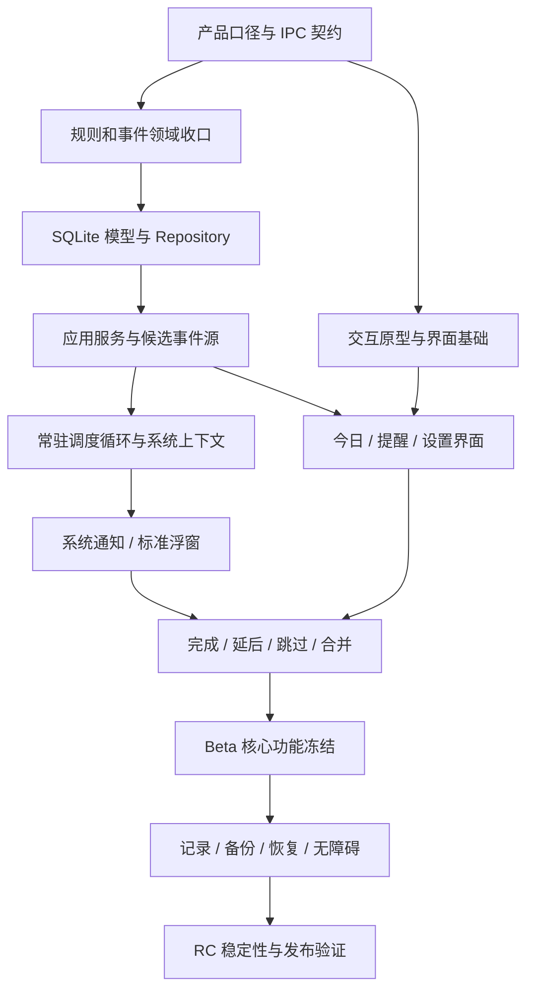

# 摸个鱼 · TakeFive 开发任务拆分与里程碑

**文档版本：** V1.0  
**文档日期：** 2026-07-14  
**需求基线：** 《TakeFive 产品功能详细设计 V1.2》  
**技术基线：** 《TakeFive 技术架构设计 V1.0》  
**适用范围：** Windows 首个正式版本；macOS 作为 P1 后续适配  
**文档状态：** 已确认，可用于研发排期、任务认领、迭代验收和发布决策  

---

## 1. 开发结论确认

### 1.1 本轮确认的开发策略

1. **Windows 优先发布。** 核心领域和应用层保持跨平台，首版只承诺 Windows 10/11 实机质量；macOS 不阻塞 Windows 正式版。
2. **先打通纵向闭环，再扩展页面。** 第一条可用链路必须是“创建固定/一次性提醒 -> 保存 -> 后台调度 -> 真实投递 -> 用户处理 -> 历史可查”。
3. **Rust 主进程是唯一调度权威。** React 只展示和提交用户意图，不用前端定时器决定提醒是否到期。
4. **SQLite 是唯一事实来源。** 内存队列、页面缓存和托盘状态均可由数据库重建。
5. **既有阶段 1 代码继续复用。** 不重写已经通过测试的时间规则、事件状态机、事务认领和策略引擎，只补齐产品口径并完成真实接线。
6. **外观和复杂统计不进入关键路径。** 深浅色、基础记录和备份进入首版；六套主题、复杂图表、自定义声音放到 P1。
7. **每个里程碑必须可安装、可演示、可回归。** 不接受“模块都完成但用户流程尚未连通”的阶段完成声明。

### 1.2 首版成功闭环


上述闭环未贯通前，不安排主题扩展、复杂图表或 macOS 发布适配。

---

## 2. 当前代码基线

### 2.1 已验证结果

截至 2026-07-14，仓库验证结果：

- `cargo test --workspace`：44 项测试通过，0 失败。
- `cargo clippy --workspace --all-targets -- -D warnings`：通过，0 告警。
- `npm run build`：React/TypeScript 生产构建通过。
- Windows Release 可执行文件和阶段 0 运行截图已存在，但当前界面仍是技术预研台。

### 2.2 当前完成度矩阵

| 能力 | 当前状态 | 已有基础 | 尚缺内容 |
| --- | --- | --- | --- |
| Tauri 桌面壳 | 已完成基础 | 单实例、托盘、窗口重建、通知插件 | 产品窗口、标准提醒浮窗、休息窗口 |
| 固定时间规则 | 已完成基础 | 时区、工作日、DST 跳时和回拨防重 | 日期范围、多时间点、排除日期、持久化候选源 |
| 一次性提醒 | 已完成基础 | 绝对时刻计算 | 24 小时补发、归档、编辑与 UI |
| 对齐间隔 | 部分完成 | 锚点/index、防漂移、跨无效时段 | “时间段开始时提醒”选项、日期约束、持久化接线 |
| 会话间隔 | 部分完成 | 冻结剩余时长、恢复 | 检查点持久化、用户操作后新周期、真实系统状态接线 |
| 连续使用电脑 | 未完成 | Windows 空闲时长探针 | 完整活动状态机、检查点、触发与重置 |
| 事件状态机 | 已完成基础 | 合法转换、终态保护、延后状态 | 应用服务命令、数据库事务映射、聚合与取消延后 |
| SQLite | 已完成基础 | 核心表、迁移、事务认领、防重、软删除 | 完整提醒字段、日期/安静规则、设置、查询和备份 |
| 调度器 | 部分完成 | 对账器、策略顺序、失败持久化、恢复测试 | 数据库候选源、常驻循环、系统事件驱动、运行容器 |
| 应用服务层 | 部分完成 | `SqliteOccurrenceStore` 适配器 | 提醒 CRUD、动作、暂停、设置、历史、备份服务 |
| Windows 平台层 | 部分完成 | 空闲、全屏、多显示器探针；休眠/锁屏监听 | 运行上下文聚合、通知投递、显示器定位、开机启动 |
| 产品前端 | 未开始 | React、Query、图标库、预研页面 | 全部用户页面、表单、状态、无障碍和测试 |
| 自动化测试 | 部分完成 | 领域、SQLite、调度器和平台单元测试 | IPC 集成、前端、端到端、实机生命周期、72 小时常驻 |

### 2.3 不得误判为已完成的能力

- “通知测试成功”不等于调度器已经能够投递真实提醒。
- “规则能预览下一次时间”不等于规则可以保存、恢复并长期运行。
- “有 `occurrences` 表”不等于完成、跳过、延后和未处理已经形成事务闭环。
- “能监听休眠事件”不等于唤醒对账和错过策略已经生效。
- “前端可构建”不等于首次引导、今日页和提醒编辑器已经开发。

---

## 3. 工作量和状态口径

### 3.1 Story Point

| SP | 参考规模 | 约束 |
| --- | --- | --- |
| 1 | 半天至 1 天 | 单点修改，低风险 |
| 2 | 1-2 天 | 小功能，有明确接口 |
| 3 | 2-3 天 | 单模块完整任务 |
| 5 | 3-5 天 | 跨文件或含较多测试 |
| 8 | 1-2 周 | 跨模块高风险任务，进入迭代前应再次细分 |

SP 用于相对排期，不直接等同工时。任何超过 8 SP 的事项必须拆分后才能进入迭代。

### 3.2 状态

- **已完成：** 代码、自动化测试和当前阶段验收均存在。
- **部分完成：** 有可复用实现，但尚未满足产品闭环或完整验收。
- **未开始：** 尚无目标实现，或现有代码仅为无业务能力的骨架。
- **阻塞：** 依赖未完成，当前不应开工。

### 3.3 完成定义（DoD）

每个开发任务只有同时满足以下条件才能标记完成：

1. 代码已合入对应模块，未破坏分层边界。
2. 新增或更新自动化测试，覆盖正常路径和至少一个异常路径。
3. Rust 格式、静态检查、全量测试和前端构建通过。
4. 用户可见功能包含加载、空白、错误和禁用状态。
5. 需求文档中的原因码、文案或行为变更已同步。
6. 对应验收人已按任务验收标准确认。

### 3.4 剩余任务规模

本文件共包含 91 个可认领任务，估算为从当前代码基线走到 Windows GA 的剩余工作量。部分完成任务的 SP 表示“从当前状态完成到验收”的剩余规模，不是原始完整开发规模。

| 工作流 | 任务数 | 剩余 SP |
| --- | ---: | ---: |
| 产品与设计 PD | 10 | 47 |
| 领域核心 CORE | 12 | 58 |
| 数据 DATA | 13 | 73 |
| 应用服务 APP | 13 | 89 |
| Windows 桌面 DESK | 12 | 68 |
| React 界面 UI | 18 | 111 |
| 质量发布 QA | 13 | 79 |
| **合计** | **91** | **525** |

状态上有 30 项“部分完成”、60 项“未开始”和 1 项“阻塞等待里程碑”。该数量说明现有内核已经降低了最难的时间与防重风险，但离可发布产品仍有明显的应用接线、界面和质量工作，不能按“预研程序已经能运行”估算剩余周期。

---

## 4. 总体依赖与并行工作流



可并行的五条工作流：

| 工作流 | 主要角色 | 关键产物 |
| --- | --- | --- |
| A. 产品与设计 | 产品、交互、视觉 | 契约口径、原型、设计令牌、文案 |
| B. Rust 核心与数据 | Rust 工程师 | 领域规则、Repository、应用服务、调度器 |
| C. Windows 桌面能力 | 桌面工程师 | 通知、窗口、托盘、生命周期和安装包 |
| D. React 产品界面 | 前端工程师 | 页面、表单、状态管理、无障碍 |
| E. 质量与发布 | QA、各开发 | 自动化、实机矩阵、性能、恢复和发布证据 |

应用服务和 IPC 契约稳定前，前端可完成静态原型与 Mock 数据，但不得自行复制时间计算逻辑。

---

## 5. A 线：产品、交互与视觉

| ID | 任务 | 状态 | SP | 依赖 | 交付与验收 |
| --- | --- | --- | ---: | --- | --- |
| PD-01 | 冻结 V1.2 行为决策表 | 未开始 | 3 | 无 | 将规则、错过、暂停、安静、全屏和延后策略整理成机器可映射枚举；无“默认按情况处理” |
| PD-02 | 定义 IPC 字段与产品文案映射 | 未开始 | 3 | PD-01 | DTO 字段、枚举、原因码和中文文案一一对应，前后端共同评审 |
| PD-03 | 首次引导与权限分支原型 | 未开始 | 5 | PD-01 | 覆盖允许、拒绝、失败、跳过模板四条路径 |
| PD-04 | 今日页和提醒列表原型 | 未开始 | 5 | PD-01 | 覆盖正常、空态、暂停、安静、通知异常、规则异常 |
| PD-05 | 四类规则编辑器原型 | 未开始 | 8 | PD-01 | 固定、两种间隔、连续使用、一次性均可完成配置；含交叉校验 |
| PD-06 | 提醒浮窗与多提醒聚合原型 | 未开始 | 5 | PD-01 | 单条、三条、超过三条、重要提醒、延后菜单、未处理均有状态 |
| PD-07 | 暂停、安静与休息模式原型 | 未开始 | 5 | PD-01 | 暂停重叠、绝对恢复时间、进入/退出休息流程完整 |
| PD-08 | 基础视觉令牌和组件规范 | 未开始 | 5 | PD-03, PD-04 | 浅/深色、排版、间距、状态色、焦点、图标、最大 8px 圆角 |
| PD-09 | 产品文案与无障碍名称表 | 未开始 | 3 | PD-03 至 PD-07 | 所有按钮、错误、原因、无障碍名称可直接进入语言资源 |
| PD-10 | Alpha/Beta 可用性测试 | 阻塞 | 5 | 对应里程碑可用 | 每轮 5-8 人；核心任务成功率不低于 80%，形成问题清单 |

产品负责人验收 A 线，前端、Rust 和 QA 必须参与 PD-01/PD-02 评审。

---

## 6. B 线：领域模型与调度语义

| ID | 任务 | 状态 | SP | 依赖 | 交付与验收 |
| --- | --- | --- | ---: | --- | --- |
| CORE-01 | 统一类型化提醒配置模型 | 部分完成 | 5 | PD-01 | `ReminderDefinition` 覆盖名称、内容、分类、重要性、图标/颜色引用；规则配置不用无约束 JSON 在领域层流转 |
| CORE-02 | 通用日期和生效时间约束 | 未开始 | 8 | CORE-01 | 开始/结束日期、星期、排除日期、1-5 时间段、跨午夜均有纯函数测试 |
| CORE-03 | 固定时间多时间点规则收口 | 部分完成 | 3 | CORE-02 | 1-20 时间点、重复合并、当前边界、DST 和无未来事件口径符合 V1.2 |
| CORE-04 | 对齐间隔产品语义收口 | 部分完成 | 3 | CORE-02 | 默认首个完整间隔、“时间段开始也提醒”、锚点防漂移均通过测试 |
| CORE-05 | 会话间隔状态机收口 | 部分完成 | 5 | CORE-02 | 冻结/继续、恢复后重计、动作后新周期、跨工作日清零均可注入时钟测试 |
| CORE-06 | 连续使用电脑状态机 | 未开始 | 8 | CORE-02 | 活跃、短暂空闲、离开、有效休息、锁屏、休眠、阈值到期状态完备 |
| CORE-07 | 一次性提醒错过和时区语义 | 部分完成 | 3 | PD-01 | 绝对时刻、24 小时补发、过期归档和时区展示规则可测试 |
| CORE-08 | 事件动作语义收口 | 部分完成 | 5 | CORE-03 至 CORE-07 | 完成、跳过、未处理、重复延后、取消延后、编辑中事件版本的转换唯一 |
| CORE-09 | 同提醒延后冲突合并算法 | 未开始 | 5 | CORE-08 | 与下一计划相差不超过 5 分钟时只形成一次可操作事件，统计分母正确 |
| CORE-10 | 多提醒聚合会话模型 | 未开始 | 5 | CORE-08 | 60 秒会话、动态追加、关闭后不重开、重要排序和全屏休息摘要可测试 |
| CORE-11 | 原因码和用户结果统一 | 部分完成 | 3 | PD-02, CORE-08 | 领域、策略、数据库和 UI 使用同一组稳定 code；每个 code 有中文说明 |
| CORE-12 | 时间规则属性测试与边界矩阵 | 部分完成 | 5 | CORE-02 至 CORE-11 | 覆盖跨午夜、月末、年末、DST、时间回拨、无效范围和随机规则不变量 |

CORE-02、CORE-06、CORE-08 是该工作流的高风险任务，必须由至少一名熟悉时间模型的工程师评审。

---

## 7. C 线：SQLite 与数据安全

| ID | 任务 | 状态 | SP | 依赖 | 交付与验收 |
| --- | --- | --- | ---: | --- | --- |
| DATA-01 | V3 数据库迁移设计 | 部分完成 | 5 | CORE-01, CORE-02 | 补齐提醒元数据、活动时间段、排除日期、安静规则、用户动作和运行检查点；向前迁移可重复 |
| DATA-02 | 类型化提醒聚合 Repository | 部分完成 | 8 | DATA-01 | 创建/编辑提醒及规则、策略在单事务内完成；失败全回滚 |
| DATA-03 | 候选事件查询和下一次缓存 | 未开始 | 8 | DATA-02, CORE-03 至 CORE-07 | 从数据库生成到期候选和下一次时间；缓存可删除重建 |
| DATA-04 | 事件动作事务 | 部分完成 | 5 | CORE-08, DATA-01 | presented -> completed/skipped/snoozed/unhandled 原子更新；并发动作仅一个成功 |
| DATA-05 | 投递尝试 Repository | 部分完成 | 3 | DATA-01 | 每次通道、结果、错误和时间写入 `delivery_attempts`，不保存提醒正文 |
| DATA-06 | 全局/单条暂停 Repository | 未开始 | 5 | DATA-01 | 开始、修改、取消、过期查询幂等；重启后状态恢复 |
| DATA-07 | 安静时段 Repository | 未开始 | 5 | DATA-01 | 每周规则、跨午夜、重叠查询和临时退出可持久化 |
| DATA-08 | 设置与运行状态 Repository | 未开始 | 5 | DATA-01 | 通知、声音、冷却、工作开始时间、主题和运行检查点有版本控制 |
| DATA-09 | 历史与今日查询 | 未开始 | 5 | DATA-04 | 按日期、提醒、结果分页查询；未展示原因和合并关系完整 |
| DATA-10 | 软删除、最近删除和清理任务 | 部分完成 | 3 | DATA-02 | 30 天恢复、历史保留、过期清理不会级联误删 |
| DATA-11 | 配置快照和只读保护 | 未开始 | 8 | DATA-02, DATA-08 | 最近 5 份快照、损坏恢复、写失败进入只读；不得返回假成功 |
| DATA-12 | 导出、导入和恢复事务 | 未开始 | 8 | DATA-02, DATA-11 | 版本化文件、合并/替换、替换前快照、失败零污染、校验错误可理解 |
| DATA-13 | 数据迁移与恢复集成测试 | 部分完成 | 5 | DATA-01 至 DATA-12 | 从旧 schema 升级、损坏文件、重复导入、磁盘不可写均有自动化证据 |

所有 Repository 只能返回结构化错误，不得让 SQL 文本直接进入用户界面。

---

## 8. D 线：应用服务与常驻调度运行时

| ID | 任务 | 状态 | SP | 依赖 | 交付与验收 |
| --- | --- | --- | ---: | --- | --- |
| APP-01 | 应用运行容器和依赖初始化 | 部分完成 | 5 | DATA-01 | 启动时初始化目录、日志、SQLite、Repository、服务和调度器；失败进入明确模式 |
| APP-02 | 提醒 CRUD 服务 | 未开始 | 8 | DATA-02, CORE-11 | 创建、编辑、复制、启停、暂停、软删除、恢复和预览统一校验 |
| APP-03 | 数据库 CandidateSource | 未开始 | 8 | DATA-03 | 固定、两类间隔、连续使用、一次性和待恢复事件转换为 `PlannedCandidate` |
| APP-04 | 常驻调度循环 | 部分完成 | 8 | APP-01, APP-03 | 等待最近候选或系统事件；30 秒兜底对账；主窗口关闭后持续运行 |
| APP-05 | 运行上下文聚合器 | 部分完成 | 8 | DATA-06 至 DATA-08 | 启用、时间段、暂停、安静、会话、冷却、全屏合成单一快照并带来源 |
| APP-06 | 系统事件驱动对账 | 部分完成 | 5 | APP-04, APP-05 | 启动、唤醒、解锁、时间/时区和配置变化触发正确范围重算 |
| APP-07 | 用户动作服务 | 未开始 | 8 | DATA-04, CORE-08 | 完成、跳过、延后、取消延后、未处理、休息完成均幂等 |
| APP-08 | 延后与聚合协调器 | 未开始 | 8 | APP-07, CORE-09, CORE-10 | 5 分钟同提醒合并和 60 秒多提醒动态追加真实落库 |
| APP-09 | 暂停与安静服务 | 未开始 | 5 | DATA-06, DATA-07, APP-05 | 开始/取消/临时退出后即时触发对账并返回绝对恢复时间 |
| APP-10 | 连续使用检查点服务 | 未开始 | 8 | CORE-06, DATA-08 | 30 秒检查点、状态切换即时落盘、异常退出偏差不超过 30 秒 |
| APP-11 | 今日、历史和设置查询服务 | 未开始 | 5 | DATA-08, DATA-09 | 面向 UI 返回完整 ViewModel，不把原始表结构暴露给前端 |
| APP-12 | 备份、恢复和诊断服务 | 未开始 | 5 | DATA-11, DATA-12 | 导出/导入、恢复详情、脱敏诊断和用户可理解错误统一入口 |
| APP-13 | 应用级并发与重启集成测试 | 部分完成 | 8 | APP-02 至 APP-12 | 两个认领者、动作竞态、重启恢复、时间回拨、写失败不重复投递 |

`APP-03 -> APP-04 -> 实际投递` 是整个项目的第一关键路径。

---

## 9. E 线：Windows 平台、窗口与投递

| ID | 任务 | 状态 | SP | 依赖 | 交付与验收 |
| --- | --- | --- | ---: | --- | --- |
| DESK-01 | Tauri State 与 IPC 契约层 | 部分完成 | 8 | PD-02, APP-01 | 版本化 DTO、命令、事件、错误码；所有数据库访问经应用服务 |
| DESK-02 | 系统通知权限服务 | 部分完成 | 3 | DESK-01 | 查询、申请、测试、打开系统设置、拒绝节流和状态变化事件 |
| DESK-03 | 系统通知 DeliveryPort | 未开始 | 5 | APP-04, DESK-02 | 真实调度事件投递；可用按钮按系统能力降级；结果写投递尝试 |
| DESK-04 | 标准提醒浮窗窗口管理器 | 未开始 | 8 | DESK-01, PD-06 | 不抢焦点、活动屏定位、固定尺寸档、隐藏/重建和窗口事件回传 |
| DESK-05 | 通知失败到浮窗降级 | 未开始 | 5 | DESK-03, DESK-04 | 同一事件最多展示一次，失败不重复播放声音，降级原因持久化 |
| DESK-06 | 多提醒浮窗动态更新 | 未开始 | 8 | APP-08, DESK-04 | 60 秒追加、关闭后新会话、超过三条展开和逐条操作 |
| DESK-07 | Windows 活动状态适配器 | 部分完成 | 5 | CORE-06 | 将空闲时长、锁屏、休眠转换为连续使用输入，不读取输入内容 |
| DESK-08 | 全屏和多显示器策略接线 | 部分完成 | 5 | APP-05, DESK-04 | 当前屏定位、拔插回可见区域、全屏不误启动休息页 |
| DESK-09 | 全屏休息窗口 | 未开始 | 8 | APP-07, PD-07 | 用户点击后进入；倒计时、暂停、提前完成、Esc 退出和单屏覆盖 |
| DESK-10 | 产品化托盘面板与菜单 | 部分完成 | 5 | APP-09, APP-11 | 状态、下一条、暂停/恢复、新建、设置、退出；退出有明确确认 |
| DESK-11 | 开机启动与关闭行为 | 部分完成 | 3 | APP-01 | 自动启动可配置；主窗口关闭后调度继续；托盘退出才停止 |
| DESK-12 | 通知、声音和焦点实机验证 | 未开始 | 5 | DESK-03 至 DESK-11 | Win10/11、静音、全屏、缩放、多屏下形成视频/日志证据 |

系统通知上的按钮能力因 Windows 版本和通知中心状态不同，产品主闭环必须始终能回退到标准浮窗。

---

## 10. F 线：React 产品界面

| ID | 任务 | 状态 | SP | 依赖 | 交付与验收 |
| --- | --- | --- | ---: | --- | --- |
| UI-01 | 产品路由、窗口壳和设计令牌 | 未开始 | 5 | PD-08 | 今日、提醒、记录、设置导航；浅/深色、稳定尺寸和错误边界 |
| UI-02 | IPC Client、Query Key 和错误模型 | 部分完成 | 5 | DESK-01 | 查询、命令、失效、乐观限制、结构化错误；不复制规则算法 |
| UI-03 | 首次引导与模板 | 未开始 | 8 | PD-03, APP-02, DESK-02 | 三步完成，权限拒绝不阻断，模板创建后显示下一次时间 |
| UI-04 | 今日页 | 未开始 | 8 | PD-04, APP-11 | 状态、下一条、时间线、轻量摘要及六类异常/空态 |
| UI-05 | 提醒列表 | 未开始 | 8 | PD-04, APP-02 | 排序、筛选、搜索、启停、暂停、测试、复制、删除和撤销 |
| UI-06 | 编辑器基础框架 | 未开始 | 5 | PD-05, APP-02 | 五段结构、实时摘要、下一次预览、未保存确认和字段错误定位 |
| UI-07 | 固定时间与一次性编辑 | 未开始 | 5 | UI-06, CORE-03, CORE-07 | 多时间点、星期、日期、时区/错过提示完整 |
| UI-08 | 两类间隔编辑 | 未开始 | 5 | UI-06, CORE-04, CORE-05 | 对齐/开始使用语义可理解，时间段过短有非阻断提示 |
| UI-09 | 连续使用编辑 | 未开始 | 5 | UI-06, CORE-06 | 三个阈值交叉校验、隐私说明、休息时长配置 |
| UI-10 | 标准提醒浮窗界面 | 未开始 | 8 | PD-06, DESK-04, APP-07 | 单条/聚合、完成、延后、跳过、超时、关闭不等于跳过 |
| UI-11 | 暂停与安静界面 | 未开始 | 5 | PD-07, APP-09 | 绝对恢复时间、规则列表、重叠状态、临时退出和重要绕过说明 |
| UI-12 | 全屏休息界面 | 未开始 | 5 | PD-07, DESK-09 | 倒计时、暂停、继续、提前完成、退出和降低动画 |
| UI-13 | 设置中心 | 未开始 | 8 | APP-11 | 通用、提醒声音、安静、外观、数据隐私、关于；保存失败回滚 |
| UI-14 | 记录与事件详情 | 未开始 | 8 | APP-11 | 今天/7/30 天、筛选、结果原因、延后链路、复制脱敏诊断 |
| UI-15 | 最近删除、导入导出和恢复 | 未开始 | 5 | APP-12 | 恢复、合并/替换确认、进度、失败零污染和恢复详情 |
| UI-16 | 全局异常和只读保护体验 | 未开始 | 5 | DATA-11, APP-12 | 通知降级、规则异常、数据库只读、快照恢复统一状态条 |
| UI-17 | 键盘、屏幕阅读器和缩放收口 | 未开始 | 5 | UI-01 至 UI-16 | Tab 顺序、焦点恢复、可读名称、200% 文本和 150% 界面缩放 |
| UI-18 | 前端组件与页面测试 | 未开始 | 8 | UI-01 至 UI-17 | 关键表单、空态、错误、操作和无障碍回归；核心业务覆盖 |

提醒编辑器是前端最高复杂度模块，UI-06 至 UI-09 应由同一责任人维护统一表单模型。

---

## 11. G 线：质量、性能与发布

| ID | 任务 | 状态 | SP | 依赖 | 交付与验收 |
| --- | --- | --- | ---: | --- | --- |
| QA-01 | 测试金字塔和用例追踪矩阵 | 部分完成 | 3 | PD-01 | V1.2 每条 P0 需求映射到单元、集成、E2E 或实机用例 |
| QA-02 | 前端测试基础设施 | 未开始 | 3 | UI-01 | Vitest/Testing Library、无障碍断言、稳定 Mock IPC |
| QA-03 | IPC 与纵向闭环集成测试 | 未开始 | 8 | DESK-01, APP-13 | 创建 -> 到期 -> 投递 -> 动作 -> 下一次 -> 历史全链路 |
| QA-04 | Fake Clock 时间矩阵 | 部分完成 | 8 | CORE-12, APP-13 | 需求 A01-A18 中可自动化的场景全部不真实等待 |
| QA-05 | Windows 生命周期实机矩阵 | 部分完成 | 8 | DESK-12 | 休眠、锁屏、关机、时间/时区、全屏、通知关闭有留档证据 |
| QA-06 | 多显示器、缩放和焦点测试 | 未开始 | 5 | DESK-08, UI-17 | 100/125/150/200%、混合 DPI、拔插、输入焦点不丢失 |
| QA-07 | 数据迁移、备份和故障注入 | 部分完成 | 8 | DATA-13, UI-15 | 旧版本升级、磁盘满/只读、损坏 DB、损坏备份和中断导入 |
| QA-08 | 无障碍审计 | 未开始 | 5 | UI-17 | 仅键盘完成创建/暂停/处理；Narrator 可读；对比度通过 |
| QA-09 | 性能和资源基线 | 未开始 | 5 | Beta 功能冻结 | 冷启动、空闲 CPU、后台内存、数据库增长和提醒误差报告 |
| QA-10 | 72 小时常驻稳定性 | 未开始 | 8 | RC 功能冻结 | 无重复、无配置丢失；CPU/内存趋势稳定；含多次休眠唤醒 |
| QA-11 | 安装、升级和卸载 | 未开始 | 5 | DESK-11 | 安装、开机启动、覆盖升级保留数据、卸载行为和残留说明 |
| QA-12 | Windows 签名与发布包 | 未开始 | 5 | QA-11 | 签名、完整性、版本信息、许可、隐私说明和回滚包齐全 |
| QA-13 | 发布候选回归与缺陷门禁 | 未开始 | 8 | QA-03 至 QA-12 | P0/P1 缺陷为 0；P2 有书面接受；全量自动化和实机矩阵通过 |

质量任务与开发并行，不得把 QA-03 至 QA-08 全部推迟到功能开发结束后。

---

## 12. 里程碑拆分

### 12.1 M1：Alpha 纵向闭环

**目标：** 用户可在真实应用中创建固定时间或一次性提醒，关闭主窗口后仍能到点收到提醒并完成处理。

范围：

- 类型化提醒模型、日期约束基础和 V3 数据库迁移。
- 提醒 CRUD、数据库候选源、常驻调度循环。
- 系统通知投递和最小标准浮窗降级。
- 产品窗口壳、首次引导、提醒列表、固定/一次性编辑器。
- 完成与跳过，基础历史落库。

退出条件：

1. UI 创建工作日 18:30 提醒，保存后立即显示下一次时间。
2. 关闭主窗口后提醒仍到点展示。
3. 重启应用后配置恢复，同一事件不重复展示。
4. 用户完成后事件落库，下一次时间正确。
5. 通知权限关闭时至少能通过标准浮窗展示。

Alpha 不要求连续使用、安静时段、完整记录页和全屏休息。

### 12.2 M2：Beta 核心功能完整

**目标：** 四类规则和主要低打扰策略全部可用，形成产品 V1.2 的核心体验。

范围：

- 对齐间隔、会话间隔和连续使用电脑。
- 完成、跳过、延后、未处理和取消延后。
- 全部暂停、单条暂停、安静时段、唤醒冷却和全屏策略。
- 今日页、完整编辑器、标准浮窗、多提醒聚合。
- 用户主动进入的全屏休息。
- 产品化托盘菜单。

退出条件：

1. V1.2 A01-A10 在自动化或实机中通过。
2. 休眠后普通循环不批量补发，一次性 24 小时内补发一次。
3. 延后不改变固定/对齐计划，5 分钟冲突只展示一次。
4. 暂停和安静重叠时状态、恢复时间和结果唯一。
5. 浮窗不抢输入焦点，多提醒不连续弹多个窗口。

### 12.3 M3：RC 数据安全与体验收口

**目标：** 功能冻结，补齐长期使用需要的记录、设置、恢复、无障碍和异常处理。

范围：

- 今日/7/30 天记录、事件原因详情。
- 设置中心、深浅色、声音和权限状态。
- 最近删除、导出导入、快照恢复、只读保护。
- 键盘、Narrator、多显示器、混合 DPI 和缩放。
- 性能优化、日志脱敏和诊断导出。

退出条件：

1. V1.2 A01-A18 全部有通过证据。
2. 导入失败、数据库只读和快照恢复不破坏现有配置。
3. 键盘可完成创建、暂停和处理提醒。
4. 125%/150% 缩放和多显示器拔插无阻断缺陷。
5. P0/P1 缺陷清零，进入 72 小时常驻测试。

### 12.4 M4：GA 正式发布

**目标：** 形成可分发、可升级、可回滚的 Windows 正式版。

范围：

- 72 小时常驻和真实生命周期测试。
- 安装、开机启动、覆盖升级、卸载和数据保留。
- Windows 签名、版本信息、隐私说明、第三方许可。
- Release Notes、已知问题和用户反馈入口。

退出条件：

- 72 小时无重复提醒、配置丢失和不可解释漏提醒。
- 冷启动、空闲 CPU、后台内存和提醒误差达到产品目标。
- 安装包签名和升级路径验证通过。
- 发布负责人、产品负责人和 QA 三方签字确认。

---

## 13. 建议迭代排期

### 13.1 团队假设

以下排期基于：

- 2 名 Rust/桌面工程师。
- 2 名前端工程师，其中 1 人可处理 Tauri 多窗口联调。
- 1 名 QA，从第一迭代开始参与。
- 产品和设计各 0.5 人持续支持。
- 迭代长度 2 周，不包含不可控的代码签名采购等待时间。

若只有 1 名全栈开发，预计周期应按 28-36 周评估，不应直接套用下表。

### 13.2 八个迭代

| 迭代 | 建议日期 | 目标 | 核心任务 | 里程碑 |
| --- | --- | --- | --- | --- |
| S1 | 07-15 至 07-28 | 契约和数据底座 | PD-01/02、CORE-01/02、DATA-01/02、APP-01、UI-01/02、QA-01/02 | 基线冻结 |
| S2 | 07-29 至 08-11 | 第一条真实提醒 | CORE-03/07、DATA-03/04、APP-02/03/04、DESK-01/03/04、UI-03/05/06/07 | Alpha |
| S3 | 08-12 至 08-25 | 提醒处理闭环 | CORE-08/11、DATA-05/09、APP-07/11、DESK-05、UI-04/10、QA-03 | Alpha 稳定 |
| S4 | 08-26 至 09-08 | 间隔与连续使用 | CORE-04/05/06、APP-10、DESK-07、UI-08/09、QA-04 | Beta 功能 |
| S5 | 09-09 至 09-22 | 低打扰和休息 | CORE-09/10、DATA-06/07、APP-05/06/08/09、DESK-06/08/09/10、UI-11/12 | Beta |
| S6 | 09-23 至 10-06 | 记录、设置和数据安全 | DATA-08/10/11/12、APP-12、UI-13/14/15/16 | RC 功能冻结 |
| S7 | 10-07 至 10-20 | 体验与故障收口 | UI-17/18、DATA-13、APP-13、QA-05/06/07/08/09 | RC |
| S8 | 10-21 至 11-03 | 稳定与发布 | QA-10/11/12/13、缺陷修复、发布资料 | GA |

这是风险可控的基准计划，不是对固定日期的承诺。若 S2 的真实投递闭环没有通过，不应按日期强行进入连续使用和复杂 UI。

### 13.3 并行容量注意事项

- S1 的 CORE-02 和 DATA-02 不能由同一人同时承诺满负荷，应分给两名 Rust 工程师并每日对齐模型。
- S2 的 APP-04、DESK-03/04 是同一纵向链路，建议由桌面工程师和核心工程师结对完成。
- UI 可在 IPC 未完成时使用 Mock，但 S2 后半必须切换真实服务并删除业务 Mock。
- QA 每个迭代至少预留 30% 容量做回归和测试基础设施，不能全部用于最后验收。

---

## 14. 第一迭代可直接认领的任务

### 14.1 S1 目标

冻结跨层契约，使一条完整提醒可以在数据库中创建、读取、预览下一次时间，并为 S2 常驻调度接线做好准备。

### 14.2 建议分工

| 角色 | 第一批任务 | 本迭代交付 |
| --- | --- | --- |
| 产品/设计 | PD-01、PD-02、PD-03、PD-04 | 行为决策表、IPC 文案表、Alpha 原型 |
| Rust 工程师 A | CORE-01、CORE-02 | 统一提醒聚合、日期与时间段模型 |
| Rust 工程师 B | DATA-01、DATA-02、APP-01 | V3 迁移、事务 Repository、运行容器 |
| 前端工程师 A | UI-01、UI-02 | 产品壳、路由、主题令牌、IPC Client |
| 前端工程师 B | UI-03 静态部分、UI-06 基础表单 | 引导和编辑器组件，不复制时间算法 |
| QA | QA-01、QA-02、CORE/DATA 验收补充 | 追踪矩阵、前端测试环境、迁移用例 |

### 14.3 S1 联合验收

- 可以通过应用服务创建一条完整固定时间提醒并重新读取。
- 规则、策略、提醒基础信息在同一事务内保存。
- 修改失败时数据库没有半条提醒。
- 后端返回自然语言摘要所需的结构化数据和准确下一次时间。
- 前端产品壳能用 Mock 展示今日、提醒和设置入口，且 IPC 类型已落地。
- 旧数据库可自动升级到 V3，重复启动不会重复迁移。

---

## 15. 需求到任务的追踪

| 产品能力 | 主要任务 | 验收阶段 |
| --- | --- | --- |
| 首次引导和模板 | PD-03、APP-02、UI-03、DESK-02 | Alpha |
| 固定时间 | CORE-02/03、DATA-03、UI-07 | Alpha |
| 一次性提醒 | CORE-07、APP-03、UI-07 | Alpha |
| 间隔提醒 | CORE-04/05、APP-03、UI-08 | Beta |
| 连续使用电脑 | CORE-06、APP-10、DESK-07、UI-09 | Beta |
| 真实后台提醒 | APP-04、DESK-03/04/05 | Alpha |
| 完成/跳过/延后 | CORE-08、DATA-04、APP-07、UI-10 | Alpha/Beta |
| 暂停与安静 | DATA-06/07、APP-09、UI-11 | Beta |
| 多提醒合并 | CORE-09/10、APP-08、DESK-06 | Beta |
| 全屏休息 | DESK-08/09、UI-12 | Beta |
| 今日和记录 | DATA-09、APP-11、UI-04/14 | Beta/RC |
| 设置 | DATA-08、APP-11、UI-13 | RC |
| 导入导出与恢复 | DATA-11/12、APP-12、UI-15/16 | RC |
| 无障碍和缩放 | UI-17、QA-06/08 | RC |
| 安装和发布 | QA-10/11/12/13 | GA |

---

## 16. 风险与决策门禁

### 16.1 最高风险

| 风险 | 早期信号 | 处理与门禁 |
| --- | --- | --- |
| 数据模型继续使用松散 JSON | 前后端各自解释字段 | S1 必须冻结类型化 DTO；未完成不得进入完整编辑器 |
| 调度器只在窗口打开时运行 | 关闭主窗口后不触发 | Alpha 必须验证主窗口销毁后真实提醒 |
| 系统通知交互能力不足 | 完成/延后按钮不可用 | 标准浮窗是强制降级通道，不把系统通知当唯一 UI |
| 休眠与时间变化重复投递 | 唤醒后批量弹窗 | Beta 前完成 Fake Clock + 实机生命周期双重验证 |
| 连续使用误判 | 短暂空闲被算作休息 | CORE-06 单独状态机和隐私说明，不混入普通间隔规则 |
| UI 复制调度算法 | 前后端下一次时间不一致 | 下一次时间和摘要由应用服务返回，前端只格式化展示 |
| 数据写失败仍显示成功 | 用户重启后配置消失 | DATA-11 是 RC 发布硬门禁，所有命令先持久化再反馈 |
| P0 范围再次扩张 | 主题/统计挤占闭环资源 | 新需求默认进入 P1，除非替换等量 P0 范围 |

### 16.2 停线条件

出现以下任一情况，应停止新增功能并优先修复：

- 同一事件可重复投递。
- 保存成功后重启丢失配置。
- 休眠唤醒后批量补发循环提醒。
- 数据库写入失败仍返回成功。
- 主窗口关闭后调度停止且用户未被告知。
- 浮窗持续抢占用户输入焦点。

---

## 17. 任务管理规则

### 17.1 任务进入迭代前（DoR）

- 关联一个产品条目和一个验收场景。
- 输入、输出、错误和状态变化明确。
- 依赖任务已完成或有稳定 Mock/接口。
- 工作量不超过 8 SP。
- 有明确责任人和验收人。

### 17.2 缺陷优先级

| 级别 | 定义 | 处理 |
| --- | --- | --- |
| P0 | 数据丢失、重复轰炸、无法退出、隐私越界 | 立即停线，修复后全量回归 |
| P1 | 核心提醒未触发、错误补发、主流程不可完成 | 当前迭代必须清零 |
| P2 | 有绕行路径的功能/显示问题 | RC 前清零或书面接受 |
| P3 | 轻微视觉、文案或低频体验问题 | 可进入后续迭代 |

### 17.3 里程碑确认人

- 产品负责人：确认行为与范围。
- 技术负责人：确认架构、数据和长期运行风险。
- QA 负责人：确认自动化与实机证据。
- 发布负责人：确认安装包、签名、升级和回滚。

Alpha、Beta、RC、GA 均需至少前三方确认；GA 还需发布负责人确认。

---

## 18. 最终确认

当前项目可以直接进入 S1，不需要重新进行技术选型或重写阶段 1 内核。第一优先级不是继续增加底层孤立能力，也不是先绘制完整产品页面，而是冻结跨层契约，并在 S2 结束前打通第一条真实提醒纵向闭环。

开发顺序确认如下：

```text
产品行为和 DTO 冻结
  -> 类型化规则与数据库聚合
  -> 提醒 CRUD 和数据库候选源
  -> 常驻调度循环
  -> 系统通知与标准浮窗
  -> 用户动作和下一轮计算
  -> 间隔/连续使用/暂停/安静
  -> 记录、设置、备份和恢复
  -> 72 小时常驻、安装签名和正式发布
```

首个开发验收点是 **Alpha 真实提醒闭环**，不是“完成了多少页面”或“编写了多少模块”。只有用户能够在真实安装应用中创建提醒、关闭窗口、到点收到、处理并在重启后保持正确，项目才算从技术预研正式进入可用产品阶段。
