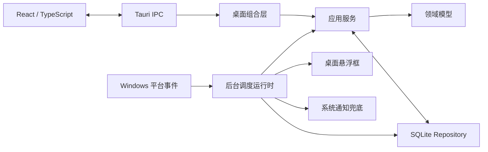

# 摸个鱼 · TakeFive 当前技术架构

**文档版本：** V1.1

**更新日期：** 2026-07-15
**状态：** 与当前 Windows MVP 实现一致

---

## 1. 文档边界

本文只描述仓库中已经接入桌面应用主链路的架构。产品能力和真机验收范围以 [MVP 开发交付](TakeFive-MVP开发交付-v1.0.md) 为准。

未接入 IPC、持久化、后台调度和界面的领域实验类型，不视为已交付功能，也不在本文展开。后续设想由 Issue 或 Milestone 管理，不在当前架构文档中预先设计。

## 2. 总体结构



依赖方向保持为：桌面与基础设施依赖应用层和领域层，领域层不反向依赖 Tauri、SQLite、React 或操作系统。

## 3. 模块职责

| 目录 | 当前职责 |
| --- | --- |
| `crates/domain` | 可注入时钟、固定时间/一次性/对齐间隔规则、Occurrence identity 与状态机 |
| `crates/persistence-sqlite` | migration、连接管理、Reminder/Pause/Occurrence Repository、revision 冲突和原子认领 |
| `crates/scheduler` | 候选、运行上下文、策略决策、认领后投递和对账协议 |
| `crates/application` | SQLite 候选源、Occurrence 存储适配器和完成/延后/跳过/未处理用例 |
| `apps/desktop/src-tauri` | 进程组合、IPC、调度循环、窗口、托盘、通知、开机启动和 Windows 生命周期事件 |
| `apps/desktop/src` | 首次引导、提醒管理、设置和悬浮框交互；不负责权威计时或数据库访问 |

## 4. 时间与规则

当前桌面链路支持三类规则：

- 固定时间：使用 IANA 时区、星期集合和本地时间计算候选。
- 按锚点对齐的间隔：使用锚点和序号计算，不以前一次实际投递时间累加，避免漂移。
- 一次性：保存绝对 UTC 时刻及来源 IANA 时区。

内部计划时刻使用 UTC，面向用户的输入、摘要和规则计算保留本地时区语义。DST 不存在时刻和重复时刻由领域规则明确处理。测试通过 `FakeClock` 和显式参考时刻推进，不依赖真实等待。

## 5. SQLite 与一致性

SQLite 是提醒、Occurrence、暂停和设置的唯一事实来源。当前 schema 包含：

- `reminders`
- `schedule_rules`
- `reminder_policies`
- `occurrences`
- `delivery_attempts`
- `pause_sessions`
- `settings`

关键约束：

- `reminders.revision` 用于更新冲突检测。
- `UNIQUE (reminder_id, occurrence_key)` 保证同一计划事件只能创建一次。
- 调度器必须先原子认领 Occurrence，再记录策略决定和尝试投递。
- 删除提醒使用软删除；禁用或删除后不再生成新的投递。
- 内存中的候选和悬浮队列都可以从 SQLite 重建，不能作为持久状态。

Occurrence 的当前主链路为：

```text
planned -> claimed -> delivering -> presented
                                   -> delivery_failed
presented -> completed / skipped / snoozed / unhandled
claimed -> suppressed -> delivering / ignored_by_dnd / missed_by_sleep
snoozed -> delivering
```

所有用户动作都通过应用服务和状态机落库，前端不能直接改写状态。

## 6. 调度与恢复

后台调度器由 Rust 进程持有，主窗口关闭后仍继续运行。它在以下事件发生时重新对账：

- 应用启动
- 到达下一候选时刻
- 提醒、暂停或设置变化
- 休眠/唤醒
- 锁屏/解锁
- 系统时间变化
- 系统时区变化

启动时使用 24 小时回看窗口恢复可处理事件，平时等待下一条规则或延期事件，并以 30 秒作为系统事件丢失时的兜底核对上限。唤醒和解锁后设置 30 秒冷却。

策略顺序由 `crates/scheduler` 统一决定，输入包括提醒启用状态、生效时段、暂停、安静时段、会话可用性、唤醒冷却和全屏状态。循环提醒在暂停、安静或不可用期间跳过；一次性提醒在允许窗口内延期，过期后标记错过。恢复不会批量补发循环提醒。

## 7. 投递与窗口

正常投递优先使用右下角透明悬浮框：

1. 将悬浮投递 payload 写入 `delivery_attempts`。
2. 创建或更新固定尺寸的悬浮窗口。
3. 展示成功后将 Occurrence 标记为 `presented`。
4. 悬浮框创建失败时才尝试系统通知。
5. 两个通道都失败时记录 `delivery_failed`。

多条提醒按到达顺序展示。未完成的悬浮投递可在进程重启后从 SQLite 恢复。完成、延后、跳过、手动收起和超时均调用 Rust IPC，并在成功落库后推进队列。

主窗口和悬浮窗口是两个独立 WebView。React 只负责展示与提交用户意图，不使用 `setTimeout` 判断提醒是否到期；悬浮框的自动收起计时只控制已经投递后的界面生命周期。

## 8. 当前 IPC 边界

IPC 按现有用途分组如下：

| 用途 | 命令 |
| --- | --- |
| 平台与诊断 | `probe_platform`、`preview_schedule`、`storage_status` |
| 首次启动 | `get_onboarding_status`、`complete_onboarding`、`initialize_default_health_reminders` |
| 提醒管理 | `list_reminders`、`create_reminder`、`create_one_shot_reminder`、`create_aligned_interval_reminder`、`update_reminder`、`set_reminder_enabled`、`delete_reminder`、`preview_reminder` |
| Occurrence 动作 | `complete_occurrence`、`skip_occurrence`、`snooze_occurrence`、`mark_occurrence_unhandled` |
| 暂停与设置 | `get_pause_status`、`pause_all`、`resume_all`、`get_reminder_settings`、`update_reminder_settings`；提醒设置 DTO 包含窗口与托盘共用的 `appDisplayName` |
| 桌面集成 | `get_autostart_status`、`set_autostart_enabled`、`get_reminder_surface_payload`、`dismiss_reminder_preview` |

修改命令名、字段或错误语义时，必须同步 Rust DTO、前端调用方和测试，并保持已有调用兼容。

## 9. 平台边界

Windows 是当前开发与验收平台。平台适配负责托盘、单实例、开机启动、通知、工作区定位、前台全屏探测和生命周期事件。能力读取失败时保留不可用或未知语义；全屏状态未知时采用保守抑制策略，不伪造“非全屏”。

macOS 尚未完成签名、公证和真机验证，因此不属于当前交付架构的已验证能力。

## 10. 变更约束

- 新规则先进入纯领域层，并使用显式时区和可注入时钟测试。
- 新的状态变化复用 Occurrence 状态机和 Repository，不直接写 SQL 绕过约束。
- 新投递通道仍需遵守“先认领、再投递、结果落库”。
- 新的内存队列必须提供从 SQLite 恢复的路径。
- 涉及调度、DST、休眠、锁屏或系统时间变化时，必须增加 Rust 自动化测试。
- 涉及 IPC 或用户可见行为时，同步更新本文或 MVP 交付文档。
