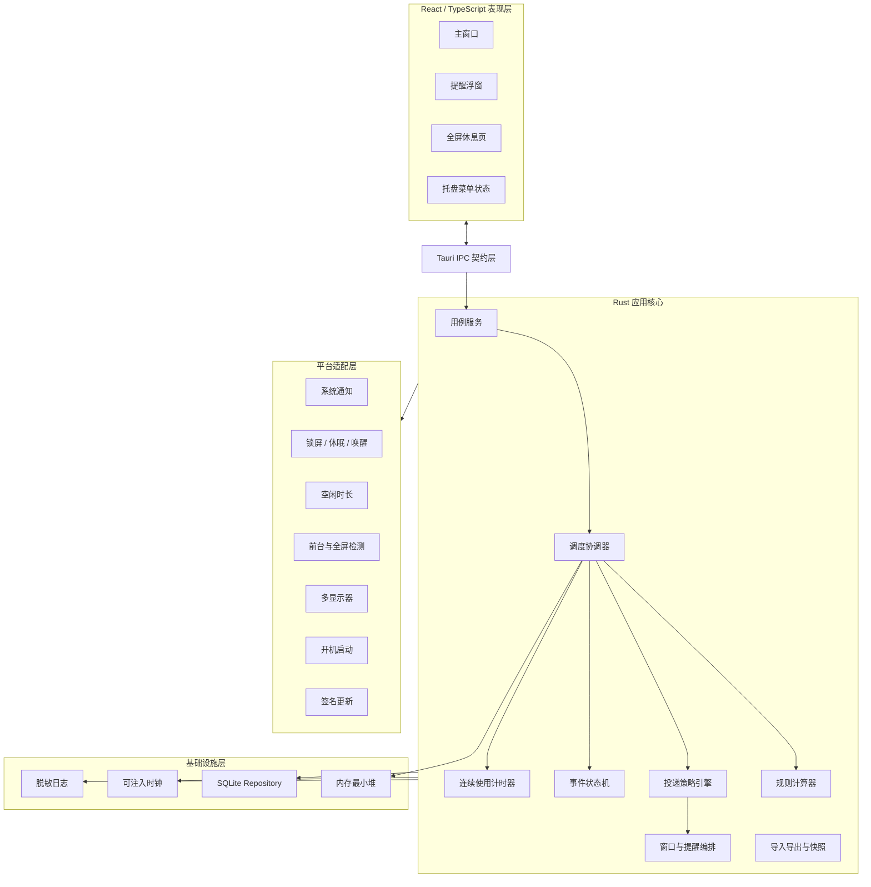
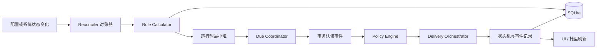
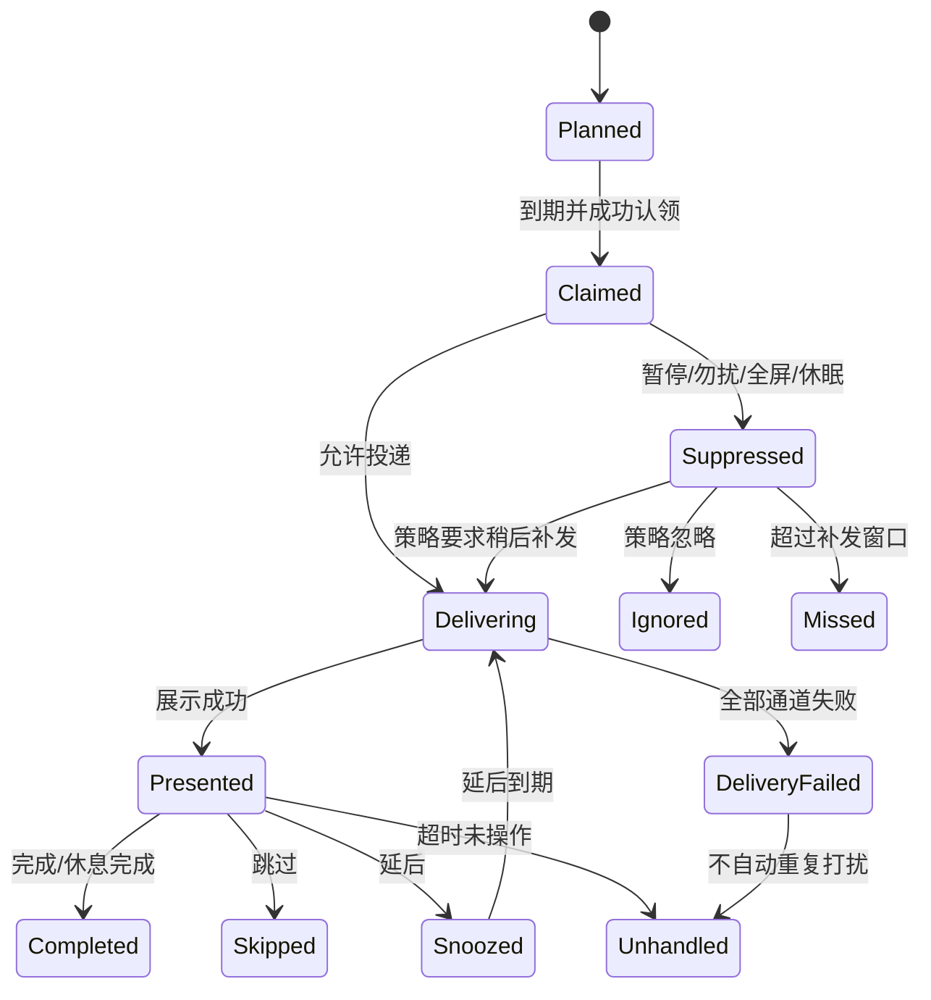
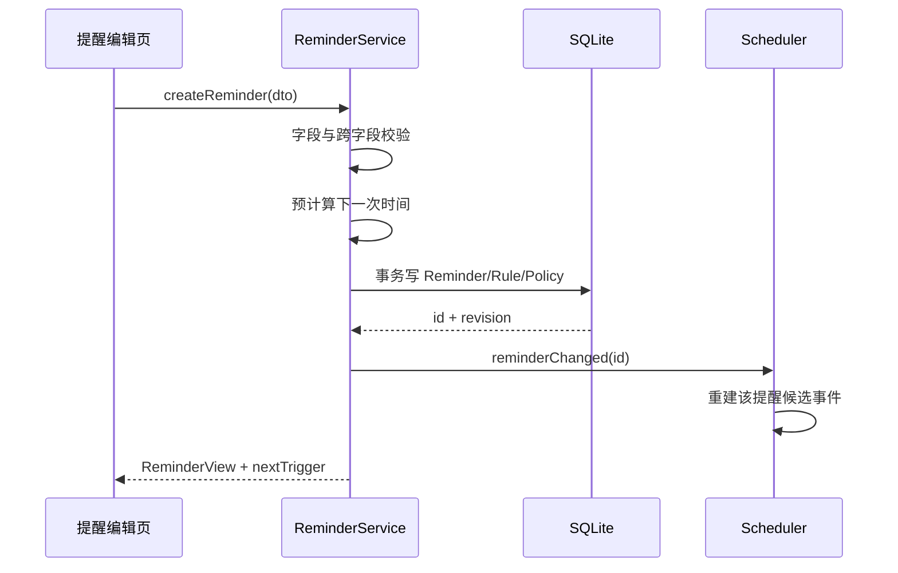
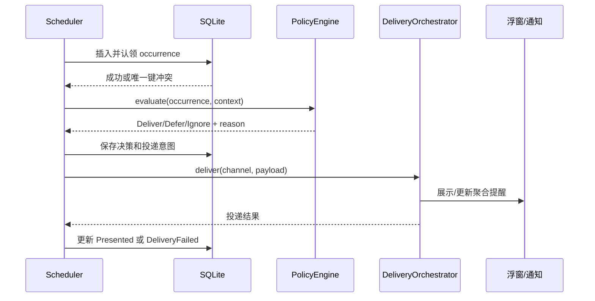
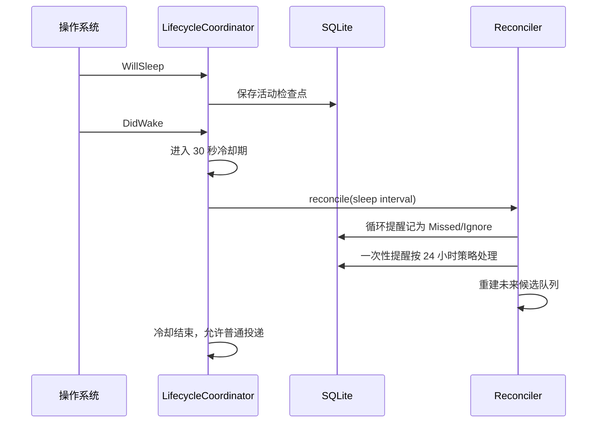

# 摸个鱼 · TakeFive 技术架构设计

**文档版本：** V1.0  
**对应需求版本：** V1.1  
**文档日期：** 2026-07-14  
**适用范围：** Windows / macOS 首个正式版本（P0）  
**架构状态：** 建议基线，可用于技术评审、任务拆分与开发排期

---

## 1. 架构结论

TakeFive 建议采用 **Tauri 2 + Rust + React/TypeScript + SQLite** 的本地优先桌面架构：

- Rust 主进程负责提醒调度、状态流转、本地数据、系统事件监听、通知投递和恢复。
- React WebView 只负责主窗口、提醒浮窗、全屏休息页等交互与展示，不承担可靠计时。
- SQLite 是本机唯一事实来源；内存队列只是可重建的运行时索引。
- 所有时间规则统一编译为“下一候选事件”，再由策略引擎判断暂停、勿扰、全屏、休眠和合并。
- Windows 与 macOS 的差异收敛到平台适配层，领域层不直接依赖 Win32、AppKit 或 Tauri API。
- 核心功能完全离线；更新检查和用户主动反馈是唯一允许联网的能力。

该方案优先保障四个目标：**提醒不重复、重启可恢复、休眠后不轰炸、长期常驻资源可控**。

---

## 2. 架构目标与约束

### 2.1 质量属性优先级

| 优先级 | 质量属性 | 技术含义 |
| --- | --- | --- |
| P0 | 正确性 | 同一计划事件最多展示一次；状态变化有确定结果 |
| P0 | 可恢复性 | 崩溃、重启、休眠、锁屏和时间变化后可重建运行状态 |
| P0 | 本地隐私 | 提醒内容、记录和活动状态默认不离开设备 |
| P0 | 低打扰 | 勿扰、暂停、全屏和合并策略在投递前统一执行 |
| P0 | 跨平台一致性 | 核心语义一致，系统能力不足时明确降级 |
| P1 | 性能与功耗 | 空闲 CPU 平均低于 1%，后台内存目标不高于 150 MB |
| P1 | 可测试性 | 调度器可注入时钟和系统状态，不依赖真实等待 |
| P1 | 可演进性 | 后续可增加节假日、自定义声音和快捷键，不重写核心模型 |

### 2.2 明确约束

- 无账号、无云端服务、无业务后端。
- 主窗口关闭后，应用仍在托盘或菜单栏运行。
- 操作系统定时器不保证在休眠期间执行，因此唤醒后必须重新对账，不能依赖“补跑定时器”。
- 系统通知中心并非可靠消息队列，数据库中的事件状态才是事实依据。
- macOS 专注模式、会议状态等能力不能保证被第三方应用可靠读取，必须支持手动模式和保守降级。
- 所有用户可见时间按本地时区展示，内部事件时间使用 UTC 存储，并保留规则的时区语义。

---

## 3. 技术选型

### 3.1 推荐技术栈

| 层次 | 推荐方案 | 用途 |
| --- | --- | --- |
| 桌面框架 | Tauri 2 | 窗口、托盘、菜单、IPC、打包、签名更新 |
| 本地核心 | Rust stable | 调度器、状态机、平台监听、数据访问、备份恢复 |
| 前端 | React + TypeScript + Vite | 四个主页面、编辑器、浮窗、休息页 |
| 服务端状态缓存 | TanStack Query | IPC 查询缓存、失效和加载状态 |
| 界面状态 | Zustand | 临时 UI 状态，不存放业务事实 |
| 表单与校验 | React Hook Form + Zod | 提醒规则编辑与即时校验 |
| 可访问组件 | Radix Primitives | 对话框、菜单、开关、标签页等基础交互 |
| 国际化 | i18next | 首版简体中文，预留多语言资源 |
| 本地数据库 | SQLite + SQLx | 配置、事件、设置、迁移和事务 |
| 序列化 | Serde | IPC DTO、规则参数、备份文件 |
| 时间处理 | time + chrono-tz | UTC、本地时间和 IANA 时区规则 |
| 日志 | tracing | 本地结构化诊断日志，默认脱敏 |
| 音频 | rodio/cpal 封装 | 播放内置声音并跟随系统输出设备 |
| 单元/属性测试 | Rust test + proptest | 时间边界、状态机和不变量验证 |
| 前端测试 | Vitest + Testing Library | 页面逻辑和无障碍行为 |
| UI 自动化 | Playwright（Web 模式）+ 平台冒烟测试 | 主流程与跨平台安装包验证 |

### 3.2 为什么不建议 Electron

Electron 开发生态成熟，但常驻 Chromium 与 Node.js 对本产品的内存、启动速度和后台功耗目标不利。TakeFive 的复杂度集中在系统事件和可靠调度，而不是浏览器能力，因此将核心放在 Rust、界面复用系统 WebView 更合适。

### 3.3 为什么不采用纯前端定时器

`setTimeout`、Web Worker 和页面生命周期不能正确覆盖休眠、WebView 回收、时间回拨及主窗口关闭。前端可以显示倒计时，但不得决定事件是否到期。

### 3.4 备选方案

如果 Tauri 在项目技术预研中无法满足 macOS 多窗口、辅助功能或系统事件稳定性，可切换为 Flutter + 原生插件。领域模型、SQLite 表结构、调度算法和测试用例应保持不变，仅替换 UI 与平台适配层。

---

## 4. 总体架构



### 4.1 分层职责

**表现层**

- 展示查询结果并提交用户意图。
- 不直接读写数据库。
- 不自行计算权威的下一次提醒时间。
- 倒计时只做视觉刷新，到零后向核心重新查询。

**应用层**

- 编排创建提醒、暂停、延后、完成、导入等用例。
- 控制事务边界和权限边界。
- 将领域事件发布给 UI 和托盘状态。

**领域层**

- 定义提醒规则、事件、状态机、投递决策和不变量。
- 不依赖 Tauri、SQLite 和具体操作系统。

**基础设施层**

- 实现数据库、日志、文件和内存队列。
- 数据库是唯一事实来源；队列在启动后从数据库重建。

**平台适配层**

- 将 Win32、AppKit、Core Graphics、IOKit 等差异转换为统一事件。
- 平台能力失败时返回 `Unavailable/Denied/Unknown`，不伪造“正常”。

---

## 5. 进程、线程与生命周期

### 5.1 运行模型

- 每台设备只允许一个 TakeFive 主实例。
- Rust 主进程常驻，系统 WebView 负责渲染各窗口。
- 调度器运行在 Tokio 异步运行时中，但领域计算保持同步、纯函数化。
- 数据库写入通过受控连接池串行化关键事务，避免多个窗口同时修改造成竞态。
- 系统事件监听器将原生回调转换成内部消息，不在系统回调线程中执行数据库操作。

### 5.2 启动顺序

1. 获取单实例锁；若已有实例，唤起已有主窗口并退出新进程。
2. 初始化目录、日志和数据库连接。
3. 执行数据库迁移；失败时进入只读恢复模式。
4. 校验关键配置；损坏时尝试最近快照。
5. 加载暂停、勿扰、未完成事件和连续使用检查点。
6. 订阅锁屏、休眠、显示器、时间和时区变化。
7. 执行一次启动对账，计算错过事件及下一候选事件。
8. 启动调度循环、托盘和权限状态检查。
9. 根据启动参数决定是否显示主窗口。

### 5.3 退出顺序

1. 标记正在正常退出，停止接收新用例。
2. 持久化活动计时检查点和运行状态。
3. 刷新待写日志并关闭数据库。
4. 写入 `last_clean_shutdown_at`。

系统强制终止时不能依赖退出回调，因此所有重要状态必须在发生时事务化持久化。

---

## 6. 领域模型

### 6.1 四个必须分离的对象

| 对象 | 含义 | 示例 |
| --- | --- | --- |
| Reminder | 用户配置的提醒定义 | “工作日每 60 分钟喝水” |
| Occurrence | 某一次计划事件 | “2026-07-14 10:00 这一次喝水” |
| DeliveryAttempt | 某次展示尝试 | 系统通知失败后改用桌面浮窗 |
| UserAction | 用户对事件的处理 | 完成、延后、跳过、开始休息 |

不能只在 Reminder 上记录“最后触发时间”，否则无法可靠处理延后、合并、补发、重试和历史统计。

### 6.2 核心类型

```text
ReminderDefinition
  id, name, content, category, importance, enabled
  schedule_rule, active_date_rule, active_windows
  delivery_policy, snooze_policy, unattended_policy, dnd_policy
  revision, created_at, updated_at, deleted_at

ScheduleRule
  FixedTimes | AlignedInterval | SessionInterval | ComputerUsage | OneShot

Occurrence
  id, reminder_id, reminder_revision
  occurrence_key, scheduled_at_utc, scheduled_local, timezone_id
  state, result, suppression_reason
  display_at, handled_at, snooze_count

RuntimeContext
  session_state, idle_state, fullscreen_state
  global_pause, reminder_pause, dnd_state
  notification_capability, active_display
```

### 6.3 关键不变量

- `reminder_id + occurrence_key` 全局唯一。
- 终态事件不能重新进入非终态。
- 延后只创建本次事件的临时到期时间，不修改原规则锚点。
- 删除提醒不能级联删除历史事件。
- 导入替换必须在单一事务中完成，失败时原数据保持不变。
- `next_trigger_at` 是可重建缓存，不是业务事实。
- 重要提醒只有在全局设置显式允许后才能绕过暂停或勿扰。

---

## 7. 调度器设计

### 7.1 组件拆分



### 7.2 核心原则

1. **数据库先于展示：** 到期事件先以事务认领，再请求系统通知或浮窗，降低崩溃后重复展示概率。
2. **队列可丢弃：** 内存最小堆只保存近期下一事件，任何时候都能由数据库和规则重建。
3. **事件驱动重算：** 配置修改、暂停结束、解锁、唤醒、时区变化和系统时间跳变都会触发对账。
4. **不补跑所有定时器：** 唤醒后根据错过策略计算结果，而不是执行休眠期间积压的回调。
5. **偏向最多展示一次：** 在数据库写入成功但展示结果未知的极小故障窗口中，默认不自动重弹，避免重复打扰；记录诊断状态供用户查看。

### 7.3 调度循环

```text
loop:
  读取最早的 next candidate
  等待 min(candidate - now, 30 秒) 或系统事件

  若收到系统事件:
    更新 RuntimeContext
    执行受影响范围的 reconcile
    continue

  若候选已到期:
    在事务中插入/认领 Occurrence（唯一键防重）
    重新读取最新 RuntimeContext
    执行投递策略
    持久化决策与投递意图
    投递或记录抑制结果
    计算该 Reminder 的下一候选事件
```

30 秒上限用于发现少量未收到的系统时间变化通知，不用于提供 2 秒精度。正常到期由精确异步定时器唤醒。

### 7.4 事件唯一键

不同规则使用稳定且可复算的 `occurrence_key`：

- 固定时间：`local-date + local-time + timezone + fold`。
- 固定钟点循环：`anchor + interval-index`。
- 启动/恢复后循环：`session-id + interval-index`。
- 连续使用电脑：`activity-cycle-id + threshold-crossing-index`。
- 一次性提醒：`reminder-id + one-shot-revision`。
- 延后不创建新的计划事件，只为原事件增加 `snooze_due_at` 和投递尝试。

数据库唯一约束是防重复的最后防线，不能只依赖内存中的 `last_fired_at`。

### 7.5 固定时间规则

- 将星期、日期范围、排除日和本地时间组合为候选本地日期时间。
- 使用规则绑定的 IANA 时区转换为 UTC。
- 当前实现把创建时选定的 IANA 时区持久化为 `timezone_mode=Named`；设备旅行或系统时区变化不会暗中改写规则，星期也始终按该命名时区计算。
- 后续如提供“跟随系统时区”，必须在系统时区事件后用新的 IANA 时区重建规则和候选事件，再持久化新的 revision；不能只把元数据标为 `FollowSystem`，否则声明与调度行为不一致。
- 春季跳时导致本地时间不存在时，顺延到该日第一个有效时刻并标记 `dst_adjusted`。
- 秋季回拨导致本地时间重复时，只触发第一次；唯一键中的 `fold` 与已存在事件共同防重。

### 7.6 间隔循环

**固定钟点循环**

- 保存本地锚点和间隔分钟数。
- 通过整数除法直接计算下一个索引，不能从“上次实际展示时间”累加，否则会逐次漂移。
- 超出有效时间段的候选跳到下一个有效时间段起点。

**启动或恢复后循环**

- 每次有效会话开始生成 `session_id` 和新锚点。
- 锁屏、休眠、全局暂停或进入无效时间段时冻结剩余时长。
- 恢复后从剩余时长继续，或依据用户配置重新开始完整间隔。
- 需求中的“恢复后开始计算”建议在产品中明确为“重新计时”，避免与“暂停后继续”混淆。

### 7.7 连续使用电脑规则

连续使用计时器维护以下状态：

```text
Inactive -> Active -> TemporarilyIdle -> RestQualified -> Active
                    -> Locked/Sleeping -> Active
```

- 只读取系统提供的最后输入空闲时长，不读取任何按键或鼠标内容。
- 空闲达到“离开电脑阈值”后停止累计。
- 空闲达到“有效休息时长”后，本轮累计清零并创建新 cycle。
- 短暂空闲结束后继续原 cycle。
- 锁屏和休眠立即停止累计；恢复后按有效休息规则决定清零或继续。
- 每次状态切换立即落盘，持续活跃时每 30 秒写入轻量检查点。
- 异常退出最多引入约 30 秒的连续使用计时偏差，不影响固定时间提醒精度。

### 7.8 延后与下一计划合并

当 `abs(snooze_due_at - next_scheduled_at) <= 5 分钟`：

1. 保留原事件作为主事件。
2. 下一计划事件记录为 `MergedReplaced`，引用主事件 ID。
3. 展示一次提醒，界面注明“延后时间与下一次计划接近，已合并”。
4. 统计只增加一次可操作提醒，不重复计算完成率分母。

### 7.9 多提醒 60 秒合并

为了同时满足“按时展示误差不超过 2 秒”和“60 秒内提醒合并”，不能简单等待 60 秒再弹窗。采用 **可更新聚合会话**：

- 第一条事件到期后立即展示，创建 60 秒聚合会话。
- 后续普通事件到期时追加到同一浮窗并更新内容，不重新弹出窗口。
- 系统通知支持相同 group/tag 替换时更新摘要；不支持时保持已有通知，后续事件进入应用浮窗和时间线。
- 重要提醒排序在首位，但不覆盖或丢弃普通事件。
- 全屏休息事件只展示摘要，必须由用户点击后进入休息页。

---

## 8. 状态机与策略引擎

### 8.1 Occurrence 状态机



### 8.2 终态结果

终态包括 `Completed`、`Skipped`、`Unhandled`、`IgnoredByDnd`、`MissedBySleep`、`MergedReplaced` 和 `Archived`。`Snoozed` 是中间态，不是最终统计结果。

### 8.3 投递决策顺序

策略引擎严格按以下顺序生成一个可解释的 `Decision`：

1. 提醒是否启用，规则版本是否仍有效。
2. 是否在生效日期与时间段。
3. 是否处于单条暂停。
4. 是否处于全局暂停。
5. 是否处于勿扰。
6. 是否锁屏、休眠或处于唤醒冷却期。
7. 是否处于全屏、会议或演示状态。
8. 是否与同提醒的延后事件合并。
9. 是否加入多提醒聚合会话。
10. 选择系统通知、桌面浮窗或全屏休息页。

决策结果必须带 `reason_code` 和面向用户的可本地化说明，使“为什么没提醒”可以追溯。

### 8.4 暂停与勿扰的边界

- **暂停**表示用户主动停止提醒调度，界面强调恢复时间。
- **勿扰**表示事件照常到期，但投递被策略抑制、忽略或延后。
- 两者不得共用一个布尔字段。
- 暂停期间的健康循环默认不生成待补发弹窗；一次性提醒根据错过策略处理。
- 重要提醒绕过能力由 `global_settings.allow_important_bypass` 与单条提醒设置共同决定，二者缺一不可。

---

## 9. 数据架构

### 9.1 存储位置

| 平台 | 默认目录 |
| --- | --- |
| Windows | `%LOCALAPPDATA%\\TakeFive\\` |
| macOS | `~/Library/Application Support/TakeFive/` |

目录建议包含：

```text
TakeFive/
  takefive.db
  snapshots/
  logs/
  backgrounds/
  backups-temp/
```

### 9.2 SQLite 设置

- 启用 WAL，减少 UI 查询和后台写入互相阻塞。
- 启用外键约束和 `busy_timeout`。
- 关键用例使用显式事务。
- 所有 SQL 参数化执行。
- 应用启动时执行 `PRAGMA quick_check`；异常时进入恢复流程。
- 数据库迁移只向前执行，每个版本可重复检测并记录校验结果。

### 9.3 核心表

| 表 | 主要职责 |
| --- | --- |
| `reminders` | 提醒基础字段、启用状态、规则版本、软删除 |
| `schedule_rules` | 规则类型、时区模式和类型化 JSON 参数 |
| `active_windows` | 每周生效时间段，支持跨午夜拆分 |
| `exception_dates` | 排除日期和临时停用日期 |
| `reminder_policies` | 投递、声音、延后、未处理、勿扰策略 |
| `occurrences` | 每次计划事件及最终结果 |
| `delivery_attempts` | 每次系统通知/浮窗投递结果 |
| `pause_sessions` | 全局或单条暂停及结束时间 |
| `dnd_rules` | 固定勿扰、午休和手动会议状态 |
| `activity_cycles` | 连续使用计时状态与检查点 |
| `settings` | 版本化全局设置 |
| `deleted_items` | 最近删除与到期清理时间 |
| `schema_meta` | 数据结构版本、迁移和恢复信息 |

### 9.4 关键字段示例

```sql
CREATE TABLE occurrences (
  id TEXT PRIMARY KEY,
  reminder_id TEXT NOT NULL,
  reminder_revision INTEGER NOT NULL,
  occurrence_key TEXT NOT NULL,
  scheduled_at_utc INTEGER NOT NULL,
  scheduled_local TEXT NOT NULL,
  timezone_id TEXT NOT NULL,
  state TEXT NOT NULL,
  result TEXT,
  reason_code TEXT,
  snooze_due_at_utc INTEGER,
  snooze_count INTEGER NOT NULL DEFAULT 0,
  presented_at_utc INTEGER,
  handled_at_utc INTEGER,
  merged_into_id TEXT,
  created_at_utc INTEGER NOT NULL,
  UNIQUE(reminder_id, occurrence_key),
  FOREIGN KEY(reminder_id) REFERENCES reminders(id)
);
```

### 9.5 JSON 使用边界

规则专属参数可存 JSON，例如固定时间数组、间隔和休息配置；需要筛选、关联、唯一约束和统计的字段必须独立成列。所有 JSON 都包含 `type` 和 `version`，由 Rust 枚举反序列化，禁止以无结构字典贯穿业务层。

### 9.6 时间存储规范

- 绝对时刻：UTC Unix 毫秒。
- 本地循环规则：本地日期/时间 + IANA 时区模式，不预先永久转换为 UTC。
- 一次性提醒：保存绝对 UTC，同时保存用户创建时的时区用于解释。
- 休息时长和连续使用时长：整数毫秒。
- 单调时钟只用于当前进程内计算经过时长，不直接持久化为跨进程时间。

### 9.7 数据保留

- 事件清理任务每天首次空闲时执行一次，使用小批次删除。
- 被软删除的提醒保留 30 天；历史事件是否保留由用户选择。
- 默认事件保留 365 天。
- 数据清理后按需执行增量 checkpoint，不在前台操作时强制全库 `VACUUM`。

---

## 10. IPC 与前端架构

### 10.1 IPC 原则

- 前端只能调用明确注册的命令，不暴露任意文件、Shell 或 SQL 能力。
- 命令使用版本化 DTO；Rust 与 TypeScript 类型通过生成工具同步，避免手写漂移。
- 所有写命令返回新的实体版本和受影响查询键。
- 乐观并发使用 `revision`；编辑过期数据时提示重新加载，不静默覆盖。
- 后端事件仅用于“有数据变化”的通知，收到事件后前端重新查询事实数据。

### 10.2 建议命令分组

```text
reminders.list / get / create / update / duplicate / delete / restore / test
schedule.preview / explain_next
occurrences.today / history / complete / skip / snooze
pause.start / cancel / status
dnd.set_manual / status
break.start / pause / resume / finish
settings.get / update
system.capabilities / permissions / open_settings
backup.export / inspect / import
diagnostics.summary / export
```

### 10.3 前端目录建议

```text
apps/desktop/src/
  app/
  pages/
    today/
    reminders/
    history/
    settings/
  features/
    reminder-editor/
    reminder-popup/
    break-session/
    pause-control/
  components/
  theme/
  i18n/
  bridge/
  test/
```

### 10.4 窗口管理

- 主窗口：单实例，关闭时默认隐藏。
- 标准提醒浮窗：复用一个窗口，支持聚合内容动态更新。
- 全屏休息页：按活动显示器创建受控无边框窗口；默认只覆盖一个显示器。
- 权限提示和确认框优先使用应用内无障碍对话框；系统权限必须调用原生窗口。
- 显示器拔插时由 Window Manager 重新计算可见区域并移动窗口。

---

## 11. 平台适配设计

### 11.1 统一能力接口

```rust
trait PlatformServices {
    fn notification_capability(&self) -> CapabilityState;
    fn session_events(&self) -> EventStream<SessionEvent>;
    fn idle_duration(&self) -> Result<Duration>;
    fn foreground_context(&self) -> ForegroundContext;
    fn displays(&self) -> Vec<DisplayInfo>;
    fn set_autostart(&self, enabled: bool) -> Result<()>;
    fn open_notification_settings(&self) -> Result<()>;
}
```

领域层只依赖 `CapabilityState`、`SessionEvent` 等内部类型。

### 11.2 能力矩阵

| 能力 | Windows | macOS | 降级策略 |
| --- | --- | --- | --- |
| 系统通知 | Windows App SDK/Toast | UserNotifications | 失败后使用应用浮窗 |
| 锁屏事件 | WTS Session Change | NSWorkspace/Distributed Notification | 轮询会话状态 |
| 休眠唤醒 | Power Broadcast | NSWorkspace/IOKit | 检测墙钟跳变后对账 |
| 空闲时长 | `GetLastInputInfo` | IOHIDSystem idle time | 连续使用规则标为能力不可用 |
| 前台窗口 | Win32 foreground API | NSWorkspace + Core Graphics | 仅使用手动会议/全屏模式 |
| 全屏判断 | 窗口边界与显示器工作区 | 窗口层级与屏幕边界 | 不确定时按用户保守策略 |
| 多显示器 | Win32 monitor API | NSScreen | 回退主屏幕 |
| 开机启动 | 注册启动项 | Login Item | 提供设置说明 |
| 通知设置跳转 | 系统设置 URI | 系统设置 URL/说明 | 展示分步说明 |

### 11.3 全屏检测边界

全屏判断只能作为“降低打扰”的启发式信号，不能承诺 100% 准确。检测不到时不得申请读取屏幕或辅助功能权限来换取准确率。首版应提供用户可理解的三个策略：静默记录、退出全屏后提醒、仍然提醒。

### 11.4 通知权限

- 权限状态使用 `Granted/Denied/NotDetermined/Unavailable/Unknown`，不能简化为布尔值。
- 首次请求前由 UI 展示用途说明。
- 拒绝后不影响应用内浮窗。
- 主动提示时间写入本地，七天内不重复打扰。

---

## 12. 关键流程

### 12.1 创建提醒



保存前必须能计算出下一次触发时间；若规则已结束或无有效日期，可以保存但需返回明确状态，配置错误则不允许保存。

### 12.2 到期投递



### 12.3 休眠唤醒



### 12.4 数据导入

1. 在临时目录解包并限制文件数量、单文件大小和总大小。
2. 校验 manifest 版本、哈希和 JSON schema。
3. 将数据导入临时 SQLite 数据库并运行完整约束检查。
4. “合并”时按内部 ID 和 revision 生成变更预览；同名不视为同一提醒。
5. “替换”前生成自动恢复快照。
6. 在单一事务中应用变更。
7. 成功后重建调度队列；失败时删除临时文件，原库不变。

---

## 13. 备份、快照与恢复

### 13.1 备份格式

使用扩展名 `.takefive` 的 ZIP 容器：

```text
manifest.json
settings.json
reminders.json
history.ndjson        # 用户选择时包含
checksums.sha256
```

`manifest.json` 包含产品名、格式版本、创建时间、应用版本和是否包含历史。不得包含设备名、用户名和原始系统路径。

### 13.2 自动配置快照

- 只保存配置、规则和设置，不复制大量历史事件。
- 每次配置事务成功后延迟 2 秒生成快照，连续操作合并为一次。
- 使用“写临时文件 + fsync + 原子重命名”。
- 保留最近 5 份，每份包含结构版本和 SHA-256。
- 数据库打开或校验失败时，从最新到最旧尝试恢复。
- 恢复前保留损坏数据库副本，便于用户导出诊断。

### 13.3 只读保护

出现磁盘满、数据库损坏或持续写入失败时：

- 暂停新的自动提醒投递，避免在无法写入事件唯一键时产生重复提醒。
- 保留已加载配置的查询能力，并持续显示“数据只读，提醒已暂停”的状态。
- 禁止导入和配置修改。
- 允许用户重试写入、导出诊断或从快照恢复；写入恢复并完成一次对账后再自动恢复调度。
- 只允许不产生历史事件的通知/声音测试，不允许以测试入口绕过只读保护触发正式提醒。

---

## 14. 隐私与安全

### 14.1 数据最小化

- 不记录具体按键、鼠标坐标、屏幕内容、麦克风和摄像头数据。
- 前台应用检测只保留 `fullscreen=true/false` 等决策结果；默认不持久化应用名称。
- 日志记录 Reminder ID 和错误码，不记录提醒名称与正文。
- 默认无遥测、无设备指纹、无远程配置。

### 14.2 桌面安全边界

- WebView 禁止导航到远程页面，启用严格 CSP。
- Tauri capability/allowlist 按窗口最小授权；提醒浮窗不能调用备份和文件能力。
- 所有路径使用平台文件选择器返回值并做规范化校验。
- 本地背景图限制格式、分辨率和文件大小，解码失败不得影响主进程。
- 备份导入防路径穿越和 ZIP 炸弹。
- 更新包必须通过 HTTPS 下载并验证 Tauri 更新签名；安装包另做 Windows 代码签名和 macOS Developer ID 签名/公证。

### 14.3 崩溃与诊断

- 崩溃上报默认关闭。
- 首版可以先提供“生成本地诊断包”，由用户主动发送。
- 诊断包包含应用版本、平台版本、能力状态、脱敏日志和数据库健康结果，不包含提醒正文与历史明细。
- 日志默认保留 7 天并限制总大小。

---

## 15. 性能与资源设计

### 15.1 预算

| 指标 | 目标 | 设计措施 |
| --- | --- | --- |
| 冷启动 | < 3 秒 | 延迟创建主窗口、迁移小步化、异步加载统计 |
| 空闲 CPU | 平均 < 1% | 事件驱动监听、单一到期定时器、避免高频轮询 |
| 后台内存 | < 150 MB | 系统 WebView、复用浮窗、限制历史查询和图表数据 |
| 常见交互反馈 | < 200 ms | 本地 IPC、索引查询、先返回保存结果再异步刷新统计 |
| 正常提醒误差 | <= 2 秒 | Rust 定时器 + 到期前精确等待 + 时间变化对账 |
| 数据库增长 | 可控 | 事件保留策略、索引审计、批量清理 |

### 15.2 数据库索引

至少建立：

- `occurrences(reminder_id, scheduled_at_utc)`
- `occurrences(state, snooze_due_at_utc)`
- `occurrences(scheduled_at_utc, result)`
- `reminders(enabled, deleted_at)`
- `pause_sessions(scope, ends_at_utc)`

统计查询按日期范围和提醒 ID 聚合，不把完整历史一次性传给前端。

### 15.3 功耗控制

- 空闲时长检查默认每 5 秒一次，仅在存在启用的“连续使用电脑”规则时启动。
- 全屏检测优先使用前台窗口变化事件；必要轮询不高于每 2 秒一次，且只在可能投递前开启精确检查。
- 托盘倒计时不每秒刷新；只显示分钟级状态或休息会话进度。

---

## 16. 可观测性与可解释性

TakeFive 没有云端监控，因此必须把本地可诊断性做成产品能力。

### 16.1 结构化事件

建议记录以下不含用户内容的事件：

- `scheduler.reconcile.started/completed`
- `occurrence.claimed/duplicate/suppressed/presented/handled`
- `platform.sleep/wake/lock/unlock/time_changed/timezone_changed`
- `database.write_failed/recovered`
- `notification.permission_changed/delivery_failed`
- `backup.import_validated/applied/failed`

### 16.2 “为什么没有提醒”

每个计划事件都保存 `reason_code`，今日时间线和诊断页可解释：

- 当时处于午休勿扰，已忽略本次。
- 电脑处于休眠，健康循环提醒不补发。
- 提醒已暂停至 14:00。
- 延后时间与下一计划接近，已合并。
- 系统通知不可用，已改用桌面浮窗。

这是产品“透明”原则的技术落点，也会显著降低后续问题定位成本。

---

## 17. 测试架构

### 17.1 测试金字塔

| 层级 | 内容 | 重点 |
| --- | --- | --- |
| 领域单元测试 | 规则计算、状态机、策略决策 | 快速、无数据库、注入时间 |
| 属性测试 | 任意日期、时区、间隔、暂停组合 | 不重复、不倒退、总能终止 |
| Repository 集成测试 | SQLite 事务、迁移、唯一约束 | 崩溃一致性和导入回滚 |
| 应用用例测试 | 创建、延后、完成、暂停、恢复 | Fake Clock + Fake Platform |
| 前端组件测试 | 表单、状态、键盘与读屏标签 | 无障碍与错误提示 |
| Web UI 流程测试 | 引导、创建、编辑、今日页 | Mock IPC，稳定覆盖交互 |
| 平台契约测试 | 通知、锁屏、唤醒、显示器 | Windows/macOS 真机或 CI Runner |
| 安装包冒烟 | 安装、升级、开机启动、卸载 | 签名后的候选构建 |

### 17.2 必备测试设施

- `Clock` 接口：可设置墙钟、单调时间、时区和时间跳变。
- `FakePlatform`：可发送 sleep/wake/lock/fullscreen/idle 事件。
- 临时 SQLite 数据库与故障注入 Repository。
- 调度 trace 快照：输入规则和事件序列，输出候选与决策，便于回归。
- 固定随机种子的 proptest 失败样本持久化。

### 17.3 关键不变量测试

- 任意系统时间回拨后，同一 `occurrence_key` 不会再次展示。
- 任意休眠区间不会产生健康循环提醒批量补发。
- 延后不会改变下一原始计划锚点。
- 勿扰结束最多形成一个补发聚合会话。
- 一次性提醒在 24 小时窗口外只进入时间线，不主动弹窗。
- 事务失败后提醒配置与运行队列保持旧版本。
- 导入任意损坏文件不会修改现有数据库。

### 17.4 跨平台验收矩阵

至少覆盖：

- Windows 10、Windows 11；100%、125%、150% 缩放。
- macOS 当前版本及前两个主要版本；Intel 如需支持则单独验证。
- 单屏、双屏、拔插显示器、主屏切换。
- 系统浅色/深色、降低动画、读屏模式。
- 通知允许、拒绝、运行中被关闭。
- 全屏视频、演示、游戏或独占窗口的不同表现。

---

## 18. 工程结构与依赖规则

### 18.1 仓库建议

```text
TakeFive/
  apps/
    desktop/
      src/                 # React UI
      src-tauri/           # Tauri 启动与窗口装配
  crates/
    domain/                # 纯领域模型与算法
    application/           # 用例与事务编排
    persistence-sqlite/    # SQLx Repository 与迁移
    platform-api/          # 跨平台 trait 与公共类型
    platform-windows/      # Win32 实现
    platform-macos/        # AppKit/Core Graphics/IOKit 实现
    scheduler/             # 对账器、队列和协调器
    backup/                # 导入导出与快照
  migrations/
  docs/
    adr/
  scripts/
```

### 18.2 依赖方向

```text
desktop -> application -> domain
desktop -> scheduler -> application/domain
persistence-sqlite -> application/domain
platform-windows/macos -> platform-api
application -> platform-api

domain 不得依赖 desktop、SQLite、Tauri 或具体平台。
```

### 18.3 代码质量门禁

- Rust：`fmt`、`clippy -D warnings`、单元测试、依赖漏洞审计。
- TypeScript：格式化、ESLint、类型检查、单元测试、无障碍静态检查。
- 数据库：迁移升级测试和从上一正式版数据库升级测试。
- 所有合并请求必须通过 Windows 与 macOS 构建。
- 调度核心变更必须附带时间边界或状态机测试。

---

## 19. 发布、升级与回滚

### 19.1 构建产物

- Windows：签名的 NSIS 安装包，明确安装位置、开机启动和卸载行为。
- macOS：Developer ID 签名并公证的 DMG/App，建议优先提供 Universal Binary；若体积不合适则分别发布架构包。
- 更新清单与二进制使用独立更新签名。

### 19.2 更新策略

- 核心离线功能不依赖更新服务可用。
- 默认只自动检查，不自动静默安装。
- 下载和安装必须由用户确认，更新说明可离线缓存。
- 更新前创建配置快照。
- 数据迁移必须向前兼容；应用二进制回滚时若数据库已升级，旧版本应拒绝写入并提示恢复方案。

### 19.3 发布通道

建议建立：

- `nightly`：开发团队内部验证。
- `beta`：愿意参与测试的用户，独立更新源。
- `stable`：正式用户。

首版不在界面开放任意更新源地址，防止供应链攻击。

---

## 20. 开发阶段与里程碑

### 阶段 0：技术预研（1-2 周）

- 验证 Tauri 多窗口、托盘、通知和后台常驻。
- 验证两平台锁屏、休眠、空闲时长、前台全屏和显示器事件。
- 建立 Fake Clock，完成固定时间与一次性规则最小原型。
- 在目标机器测量空闲 CPU、内存与启动时间。

**退出条件：** 平台能力矩阵有真实验证结果；不满足项确定降级方案。

### 阶段 1：可靠调度内核

- 领域模型、SQLite 迁移、Repository。
- 固定时间、固定间隔、一次性规则。
- 事件唯一键、状态机、启动/唤醒对账。
- 完成、跳过、延后与合并。

**退出条件：** 需求第 21 节中与调度相关的场景可通过自动化测试复现。

### 阶段 2：基础产品闭环

- 首次引导、今日、提醒列表与编辑器。
- 系统通知、标准浮窗、托盘/菜单栏。
- 全局暂停、单条暂停和固定勿扰。
- 通知权限与降级浮窗。

### 阶段 3：系统状态与休息模式

- 连续使用电脑计时。
- 全屏检测、会议模式、唤醒冷却。
- 全屏休息页、音频、多显示器。

### 阶段 4：记录、主题与数据安全

- 7/30 天统计、保留策略、手动补记。
- 六套主题、缩放、降低动画和无障碍。
- 导入导出、快照、只读保护和诊断包。

### 阶段 5：发布候选

- 安装、升级、签名、公证和更新。
- Windows/macOS 全矩阵测试。
- 72 小时后台稳定性与功耗测试。
- 数据损坏、磁盘满、异常终止和时间跳变演练。

---

## 21. 架构风险与应对

| 风险 | 影响 | 应对 |
| --- | --- | --- |
| macOS 全屏/专注状态不可完全读取 | 提醒可能误打扰或漏延后 | 保守策略、手动会议模式、能力状态透明展示 |
| 系统通知投递结果不可完全确认 | 数据状态与通知中心可能短暂不一致 | 数据库先记录意图、应用时间线兜底、偏向不重复弹出 |
| WebView 跨平台渲染差异 | UI、字体和缩放不一致 | 设计令牌、固定测试矩阵、关键窗口截图回归 |
| 连续使用计时依赖平台 API | 个别环境无法读取空闲时长 | 能力检测、明确禁用该规则、固定时间规则仍可用 |
| DST/时区规则复杂 | 重复或漏触发 | IANA 时区库、稳定 occurrence key、属性测试 |
| SQLite 损坏或磁盘满 | 配置或记录不可写 | WAL、原子事务、快照、只读保护、诊断入口 |
| 打包签名和公证较晚介入 | 发布延期 | 阶段 0 即建立测试证书流程，阶段 2 开始候选安装包 |
| P0 范围过大 | 可靠性被界面和个性化挤压 | 调度内核先行，按退出条件推进，P1 功能不提前进入主线 |

---

## 22. 首轮技术评审必须确认的决策

1. **macOS 最低版本与 Intel 支持范围。** 这会影响 Universal Binary、测试矩阵和原生 API 选择。
2. **“恢复后计算”的精确定义。** 是从完整间隔重新开始，还是保留暂停前剩余时长。
3. **固定时间在 DST 不存在时的策略。** 本文建议顺延到第一个有效时刻。
4. **全屏检测失败时的默认行为。** 本文建议对全屏休息页保守阻止，对普通轻提醒静默记录或延后。
5. **数据库写入失败时是否继续展示提醒。** 本文建议暂停新的自动投递，修复并对账完成后恢复，优先避免无法去重的提醒。
6. **安装包发布渠道。** 官网、GitHub Releases 或应用商店会影响更新与签名方案。
7. **是否首版提供崩溃上报。** 本文建议先做本地诊断包，远程上报后置且默认关闭。

---

## 23. 架构决策记录（ADR）建议

项目启动时至少建立以下 ADR：

| ADR | 决策 |
| --- | --- |
| ADR-001 | 采用 Tauri 2 + Rust + React，而非 Electron |
| ADR-002 | SQLite 为唯一事实来源，内存队列可重建 |
| ADR-003 | 时间统一使用 UTC 存储，循环规则保留本地时区语义 |
| ADR-004 | 事件唯一键防重，优先保证最多展示一次 |
| ADR-005 | 平台能力通过适配接口暴露并允许显式降级 |
| ADR-006 | 默认无遥测，日志不记录提醒内容 |
| ADR-007 | `.takefive` 使用版本化开放备份格式 |
| ADR-008 | 调度核心必须支持 Fake Clock 和属性测试 |

---

## 24. P0 完成定义

架构层面的 P0 完成，不只是“页面能操作”，还必须同时满足：

- 正常运行、重启、崩溃恢复、休眠唤醒和时间回拨下无重复提醒。
- 四种规则都能给出可解释的下一次触发时间。
- 所有抑制事件都有状态和原因，不出现“凭空消失”。
- 主窗口关闭后调度继续，退出应用后调度明确停止。
- 系统通知不可用时，应用浮窗可以独立工作。
- 导入失败、数据库写入失败和快照恢复不会破坏现有配置。
- Windows 与 macOS 安装包均完成签名链路验证。
- 关键调度场景有自动化回归，平台生命周期场景有真机记录。
- 72 小时后台运行满足 CPU、内存和提醒误差目标。

---

## 25. 最终建议

TakeFive 首版应把“调度内核”视为产品主干，而不是普通桌面应用中的一个定时模块。开发顺序必须保持：

```text
时间模型与状态机
  -> SQLite 一致性与恢复
  -> 平台生命周期事件
  -> 投递与窗口
  -> 页面与个性化
  -> 统计和发布体系
```

在阶段 1 完成前，不建议大量投入主题、图表和复杂动效。只要调度与恢复模型稳定，后续 UI、皮肤和 P1 能力都可以增量建设；反之，如果事件模型前期简化为“一个提醒 + 一个最后触发时间”，后续延后、勿扰、休眠、合并和统计会互相冲突，并产生难以修复的重复提醒问题。
